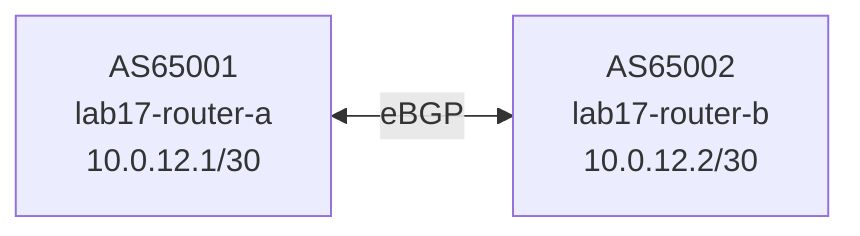

# Contributing a New Lab

This guide explains how to add a lab to the BGP Labs curriculum. A lab is a self-contained directory under `labs/` that students can start, work through, and tear down in isolation.

## 1. Pick a lab number and name

Lab numbers follow the curriculum sequence. Choose the next unused number (currently `lab17` through `lab99` are available; `lab14` is intentionally reserved/skipped).

Name format: `labNN-short-kebab-description`

```
lab17-bgp-confederation/
```

TOPO_PORT = `8300 + NN` (e.g. lab17 → port 8317). Ports 8300–8399 are reserved for bgp-labs topology-watch instances.

Container and network names must be prefixed with `labNN-` so multiple labs can run simultaneously without name collisions.

## 2. Required file structure

```
labNN-your-lab/
├── lab.json          # metadata + container/network inventory
├── README.md         # student-facing instructions
├── setup.sh          # start containers, create networks
├── teardown.sh       # stop containers, remove networks
├── smoke.sh          # behavioral assertions for CI
└── configs/
    └── router-X.conf # FRR config per container
```

All six files are required. The structural test suite (`tests/test_lab_structure.py`) enforces their presence and validates bash syntax automatically.

## 3. lab.json

```json
{
  "lab": "labNN-your-lab",
  "routers": [
    {"name": "labNN-router-a", "asn": 65001, "interfaces": ["eth0", "eth1"]},
    {"name": "labNN-router-b", "asn": 65002, "interfaces": ["eth0"]}
  ],
  "networks": [
    {"name": "labNN-a-b-link", "subnet": "10.0.12.0/30", "vni": null},
    {"name": "labNN-as1-internal", "subnet": "192.168.1.0/24", "vni": null}
  ]
}
```

Rules:
- `"lab"` must exactly match the directory name
- All container names must be globally unique across **all** labs — the test suite checks this
- `"vni"` is `null` for IP networks; set it to a VXLAN VNI integer for overlay labs
- Use the `10.0.xy.0/30` subnet family for point-to-point links; `192.168.N.0/24` for stub networks

## 4. FRR config files (`configs/*.conf`)

Each container gets one FRR config mounted at `/etc/frr/frr.conf`. Minimal template:

```
hostname router-a
!
interface eth0
 ip address 10.0.12.1/30
!
router bgp 65001
 bgp router-id 10.0.12.1
 no bgp ebgp-requires-policy
 neighbor 10.0.12.2 remote-as 65002
 !
 address-family ipv4 unicast
  network 192.168.1.0/24
  neighbor 10.0.12.2 activate
 exit-address-family
!
line vty
!
```

**Always include `no bgp ebgp-requires-policy`** — without it FRR drops all eBGP routes silently.

For labs where students configure a router from scratch, omit the BGP block entirely and leave only interface configuration. Add a comment explaining what the student will add.

## 5. setup.sh

```bash
#!/usr/bin/env bash
set -euo pipefail
LAB_DIR="$(cd "$(dirname "${BASH_SOURCE[0]}")" && pwd)"
REPO_ROOT="$(cd "${LAB_DIR}/.." && pwd)"
TOPO_PORT=83NN   # replace NN with lab number

echo "=== Lab NN: Your Lab Title ==="

# Require frr:latest
if ! podman image exists frr:latest 2>/dev/null; then
    echo "ERROR: frr:latest not found. Run labs/lab00-build-your-router/setup.sh first."
    exit 1
fi

# Clean previous run
"${LAB_DIR}/teardown.sh" 2>/dev/null || true

echo "Step 1: Creating networks ..."
podman network create labNN-a-b-link --subnet 10.0.12.0/30 2>/dev/null || true

echo "Step 2: Starting routers ..."
podman run -d --name labNN-router-a \
    --cap-add NET_ADMIN --cap-add NET_RAW --cap-add SYS_ADMIN \
    --sysctl net.ipv4.ip_forward=1 \
    --network labNN-a-b-link:ip=10.0.12.1 \
    -v "${LAB_DIR}/configs/router-a.conf:/etc/frr/frr.conf:Z" \
    frr:latest

sleep 5

. "${REPO_ROOT}/scripts/start-watchers.sh"

echo "Lab NN is up. topology-watch: http://localhost:${TOPO_PORT}"
```

Notes:
- Always source `scripts/start-watchers.sh` — this starts topology-watch on TOPO_PORT and packet-watch
- `sleep` after container start gives FRR time to load the config; BGP labs typically need 3–10s
- Use `:Z` on volume mounts (SELinux label for exclusive bind)
- The `|| true` on network create is intentional — networks persist if teardown was skipped

For IPv6 labs, add `--sysctl net.ipv6.conf.all.forwarding=1` to each container.

## 6. teardown.sh

```bash
#!/usr/bin/env bash
set -euo pipefail
echo "=== Lab NN: Teardown ==="
pkill -f "topology_watch" 2>/dev/null || true
pkill -f "packet_watch" 2>/dev/null || true
podman ps -aq --filter "name=^labNN-" | xargs -r podman rm -f 2>/dev/null || true
podman network rm labNN-a-b-link 2>/dev/null || true
echo "Done."
```

List every network created by setup.sh explicitly — `podman network rm` does not accept wildcards.

## 7. README.md

The README must contain all seven of these section headers (the test suite checks for them):

```
## Objectives
## Concepts
## Topology
## Setup
## Exercises
## Verification
## Troubleshooting
```

**Topology diagrams must use Mermaid**, not ASCII art:

````markdown

````

Keep exercises numbered and progressive. Each exercise should have a clear goal, the exact `vtysh` commands the student runs, and the expected output. Prefer showing what correct output looks like rather than leaving students to guess.

## 8. smoke.sh

The smoke test runs after `setup.sh` (containers already running) and asserts the lab's pre-configured state. Source the shared library:

```bash
#!/usr/bin/env bash
set -euo pipefail
SMOKE_LIB="$(cd "$(dirname "${BASH_SOURCE[0]}")/.." && pwd)/tests/integration/smoke-lib.sh"
source "${SMOKE_LIB}"

echo "=== Lab NN Smoke Test ==="

assert_containers_running "labNN-"

# Assert pre-configured BGP sessions are Established.
assert_bgp_established "labNN-router-a" 1 "router-a"

# Assert a key route is present.
if podman exec labNN-router-a vtysh -c "show bgp ipv4 unicast" 2>/dev/null \
   | grep -q "192.168.2.0"; then
  pass "router-a: learned 192.168.2.0/24"
else
  fail "router-a: 192.168.2.0/24 missing"
fi

smoke_summary
```

Available helpers in `tests/integration/smoke-lib.sh`:

| Helper | Purpose |
|--------|---------|
| `assert_containers_running <prefix>` | All containers with prefix are running |
| `assert_bgp_established <ctr> <min_count> [label]` | ≥N IPv4 BGP sessions Established (waits up to 30s) |
| `assert_bgp6_established <ctr> <min_count> [label]` | ≥N IPv6 BGP sessions Established |
| `assert_route_present <ctr> <prefix> [label]` | Prefix in IPv4 BGP table |
| `assert_ipv6_route_present <ctr> <prefix> [label]` | Prefix in IPv6 BGP table |
| `assert_ping_ok <ctr> <dst> [label]` | ping succeeds |
| `assert_ping_fail <ctr> <dst> [label]` | ping correctly fails |
| `assert_ping6_ok <ctr> <dst> [label]` | ping6 succeeds |
| `smoke_summary` | Print results and exit nonzero on failure |

For VXLAN labs, add a kernel module guard at the top:

```bash
if ! modinfo vxlan &>/dev/null 2>&1; then
  echo "  SKIP: vxlan kernel module not available"
  exit 0
fi
```

## 9. Register the lab

Two places to update:

**`tests/test_lab_structure.py`** — add the lab directory name to `ALL_LABS`:

```python
ALL_LABS = [
    ...
    "labNN-your-lab",
]
```

**`labs/README.md`** — add a row to the Labs table:

```markdown
| [Lab NN](labNN-your-lab/README.md) | Your Lab Title | concept-a, concept-b |
```

## 10. Validate locally

```bash
# From repo root
python -m pytest labs/tests/test_lab_structure.py -v   # should show 97+ passing

# Run the lab end-to-end
bash labs/labNN-your-lab/setup.sh
bash labs/labNN-your-lab/smoke.sh
bash labs/labNN-your-lab/teardown.sh
```

## 11. Commit

```bash
git add labs/labNN-your-lab/ labs/tests/test_lab_structure.py labs/README.md
git commit -m "feat: add Lab NN — Your Lab Title"
git push origin HEAD:main
```

Then update the parent `know` repo to advance the submodule pointer:

```bash
cd /path/to/know
git add labs
git commit -m "chore: update bgp-labs submodule (Lab NN)"
git push
```

CI (Ubuntu, AlmaLinux 9, macOS) will run `smoke-all.sh` against every lab including the new one.
