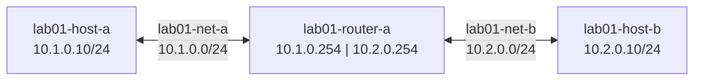

# Lab 01 — The Unreachable Network

## Objectives

- Observe why two hosts on separate networks cannot communicate without a router
- Add static routes using `vtysh` to enable reachability
- Understand why static routes don't scale to large networks

## Concepts

Every network interface belongs to a subnet — a broadcast domain where hosts
communicate directly using ARP. When a packet's destination is in a *different*
subnet, the sender must forward it to a **router** that has a path to that subnet.

Without a routing entry, the packet is dropped. This lab makes that failure visible
and shows how static routes repair it — and why you wouldn't want to manage them
manually at any real scale.

A **routing table** is a list of (destination prefix → next-hop) entries. When
a router receives a packet, it looks up the destination IP, finds the best matching
prefix, and forwards the packet to the next hop.

**Static routes** are manual entries you add yourself. They work for small,
stable topologies. When you have 1000 prefixes or routes that change dynamically,
you need a routing *protocol* — which is what BGP is.

## Topology

```
[lab01-host-a]────────────[lab01-router-a]────────────[lab01-host-b]
 10.1.0.10/24          10.1.0.254  10.2.0.254          10.2.0.10/24
      lab01-net-a (10.1.0.0/24)   lab01-net-b (10.2.0.0/24)
```



All three containers run FRR. lab01-host-a and lab01-host-b act as end hosts;
lab01-router-a is the forwarder between the two networks.

## Setup

```bash
./setup.sh
```

Three containers start: lab01-host-a, lab01-host-b, lab01-router-a.
topology-watch opens at http://localhost:8301.

Wait 5 seconds for FRR to initialize before running verification commands.

## Exercises

**Exercise 1: Confirm the failure**

```bash
podman exec lab01-host-a ping -c 5 10.2.0.10
```

Expected: `Destination Host Unreachable` or no reply. lab01-host-a has no route to 10.2.0.0/24.

Inspect lab01-host-a's routing table:
```bash
podman exec -it lab01-host-a vtysh -c "show ip route"
```

You'll see a connected route for 10.1.0.0/24 but nothing for 10.2.0.0/24.

**Reading the routing table**

The output of `show ip route` on lab01-host-a (10.1.0.10, on network lab01-net-a: 10.1.0.0/24) looks like this:

```
K>* 0.0.0.0/0 [0/100] via 10.1.0.1, eth0, 00:06:13
C>* 10.1.0.0/24 is directly connected, eth0, 00:06:13
```

Breaking it down column by column:

| Field | Meaning |
|-------|---------|
| `K` / `C` / `S` / `B` | How the route was learned: **K**ernel, **C**onnected, **S**tatic, **B**GP — see [Route Source Codes](docs/04-reference/routing-source-codes.md) |
| `>` | This is the **selected** (best) route for this prefix |
| `*` | This route is installed in the **FIB** (forwarding table — packets actually use it) |
| `0.0.0.0/0` | The destination **prefix** — written as `network-address/prefix-length`. The network address identifies the block; the `/24` (prefix length) means the first 24 bits are fixed, leaving 8 bits for hosts (256 addresses). `0.0.0.0/0` has no fixed bits — it matches every address and acts as the default route |
| `[0/100]` | `[administrative-distance/metric]`. Lower AD wins when two protocols know the same prefix — see [Administrative Distance and Metric](docs/04-reference/routing-ad-metric.md) |
| `via 10.1.0.1` | The **next-hop** — where to send the packet next. Here `10.1.0.1` is Podman's bridge gateway (not `lab01-router-a`), which is why the default route won't help reach lab01-net-b |
| `eth0` | The outgoing interface |
| `00:06:13` | How long this route has been in the table |

What's missing from host-a's table: a route for `10.2.0.0/24`. Without it, host-a
doesn't know where to send packets destined for host-b — they get dropped.

Notice also that the default route (`0.0.0.0/0`) points to `10.1.0.1` — that's
Podman's bridge gateway, not `lab01-router-a` (`10.1.0.254`). Even if host-a
tried to use the default route to reach host-b, the packet would go to the wrong
place. Static routes fix this by being more specific than the default.

**Exercise 2: Add static routes**

On lab01-host-a, add a route for the 10.2.0.0/24 network via lab01-router-a:
```bash
podman exec -i lab01-host-a vtysh << 'EOF'
configure terminal
ip route 10.2.0.0/24 10.1.0.254
end
write memory
EOF
```

On lab01-host-b, add a return route:
```bash
podman exec -i lab01-host-b vtysh << 'EOF'
configure terminal
ip route 10.1.0.0/24 10.2.0.254
end
write memory
EOF
```

**Exercise 3: Verify reachability**

```bash
podman exec lab01-host-a ping -c 5 10.2.0.10
```

Expected: `!!!!!` (5 successful pings). Watch packet-watch show the ICMP traffic.

**Exercise 4: Think about scale**

lab01-router-a already has both subnets as connected routes. Now imagine 1000 subnets —
you'd need 1000 manual entries on every router. And if one subnet changes, you update
each router by hand. This is why BGP exists.

## Verification

```bash
# Routing tables
podman exec -it lab01-host-a vtysh -c "show ip route"
# Should show: S 10.2.0.0/24 [1/0] via 10.1.0.254

podman exec -it lab01-host-b vtysh -c "show ip route"
# Should show: S 10.1.0.0/24 [1/0] via 10.2.0.254

# Connectivity
podman exec lab01-host-a ping -c 5 10.2.0.10
# Should show: 5/5 packets received
```

## Troubleshooting

**Ping still fails after adding static routes:**
Check that both hosts have the return route. lab01-host-a → lab01-host-b works
(host-a has the route), but the reply can't get back without a route on host-b.

**Debug container to inspect ARP:**
```bash
podman run --rm -it \
  --network container:lab01-host-a \
  docker.io/nicolaka/netshoot bash
# Inside: ip route, ping 10.2.0.10, ip neigh
```

**topology-watch or packet-watch port already in use:**
```bash
pkill -f topology_watch; pkill -f packet_watch
./setup.sh
```
