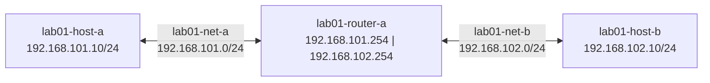

# Lab 01 — The Unreachable Network

## Objectives

- Observe why two hosts on separate networks cannot communicate without a router
- Add static routes using `vtysh` to enable reachability
- Understand why static routes don't scale to large networks

## Concepts

### Network Interfaces

A **network interface** is a logical attachment point to a network — either physical
(a NIC) or virtual (a veth, bridge, loopback, VXLAN, etc.). Every interface has:

- A **name** (`eth0`, `lo`, `vxlan0`, …)
- A **MAC address** — a hardware-level identifier unique to that interface
- One or more **IP addresses** with a **prefix length** (e.g., `/24`)
- A **state** — UP (active) or DOWN

Inspect all interfaces inside a running container with:

```bash
podman exec lab01-host-a ip addr
```

Example output:

```
1: lo: <LOOPBACK,UP,LOWER_UP> mtu 65536 ...
    link/loopback 00:00:00:00:00:00 brd 00:00:00:00:00:00
    inet 127.0.0.1/8 scope host lo

2: eth0: <BROADCAST,MULTICAST,UP,LOWER_UP> mtu 1500 ...
    link/ether aa:bb:cc:11:22:33 brd ff:ff:ff:ff:ff:ff
    inet 192.168.101.10/24 brd 192.168.101.255 scope global eth0
```

Reading it line by line:

| Field | Meaning |
|-------|---------|
| `2: eth0:` | Interface index (2) and name (`eth0`) |
| `<BROADCAST,MULTICAST,UP,LOWER_UP>` | Interface flags — `UP` means the interface is enabled; `LOWER_UP` means the physical/virtual link is active |
| `mtu 1500` | Maximum Transmission Unit — the largest single frame this interface will send (bytes) |
| `link/ether aa:bb:cc:11:22:33` | The MAC address of this interface |
| `brd ff:ff:ff:ff:ff:ff` | The broadcast MAC address |
| `inet 192.168.101.10/24` | The IPv4 address and prefix length — `/24` means the first 24 bits are the network, leaving 8 bits for hosts (addresses 192.168.101.1–254) |
| `brd 192.168.101.255` | The broadcast address for this subnet — packets to this address reach all hosts on the subnet |
| `scope global` | This address is reachable from other networks (vs. `scope host` which is loopback-only) |

The loopback interface (`lo`, 127.0.0.1/8) is present in every network namespace and
is used for local communication — packets sent to 127.0.0.1 never leave the host.

### Network Routes

A **routing table** tells the kernel where to send packets. For each destination, it
records which interface to send out of and (for non-connected networks) which next-hop
IP to forward to.

View the kernel routing table:

```bash
podman exec lab01-host-a ip route show
```

Example output (before static routes are added):

```
192.168.101.0/24 dev eth0 proto kernel scope link src 192.168.101.10
```

| Field | Meaning |
|-------|---------|
| `192.168.101.0/24` | The destination network — packets to any address in this range match this entry |
| `dev eth0` | Send out interface `eth0` |
| `proto kernel` | This route was added automatically by the kernel when the IP address was assigned |
| `scope link` | The destination is directly reachable on this link — no next-hop needed |
| `src 192.168.101.10` | When originating a packet to this network, use this source IP |

When a packet arrives destined for `192.168.102.10`, the kernel checks the routing
table. There is no entry for `192.168.102.0/24`, and there is no default route
(`0.0.0.0/0`). The packet is dropped — which is exactly the failure this lab demonstrates.

After adding a static route, the table gains:

```
192.168.102.0/24 via 192.168.101.254 dev eth0 proto static
```

| Field | Meaning |
|-------|---------|
| `via 192.168.101.254` | Forward to this next-hop IP (lab01-router-a's interface on net-a) |
| `proto static` | This route was added manually, not by the kernel or a routing protocol |

**`ip route` vs. `vtysh show ip route`:** `ip route show` reads the Linux kernel
forwarding table directly. `vtysh show ip route` reads FRR's own routing table (the
RIB — Routing Information Base). FRR installs its selected routes into the kernel,
so both views should match. FRR's view adds extra context: how the route was learned
(C/S/B), administrative distance, and age — see [Route Source Codes](../docs/04-reference/routing-source-codes.md).

Every network interface belongs to a subnet — a broadcast domain where hosts
communicate directly using ARP. When a packet's destination is in a *different*
subnet, the sender must forward it to a **router** that has a path to that subnet.

Without a routing entry, the packet is dropped. This lab makes that failure visible
and shows how static routes repair it — and why you wouldn't want to manage them
manually at any real scale.

**Static routes** are manual entries you add yourself. They work for small,
stable topologies. When you have 1000 prefixes or routes that change dynamically,
you need a routing *protocol* — which is what BGP is.

## Topology

```
[lab01-host-a]────────────[lab01-router-a]────────────[lab01-host-b]
 192.168.101.10/24          192.168.101.254  192.168.102.254          192.168.102.10/24
      lab01-net-a (192.168.101.0/24)   lab01-net-b (192.168.102.0/24)
```



All three containers run FRR. lab01-host-a and lab01-host-b act as end hosts;
lab01-router-a is the forwarder between the two networks.

## Setup

```bash
./setup.sh
```

Three containers start: lab01-host-a, lab01-host-b, lab01-router-a.

Wait 5 seconds for FRR to initialize before running verification commands.

## Exercises

**Exercise 1: Confirm the failure**

```bash
podman exec lab01-host-a ping -c 5 192.168.102.10
```

Expected: `Destination Host Unreachable` or no reply. lab01-host-a has no route to 192.168.102.0/24.

Inspect lab01-host-a's routing table:
```bash
podman exec -it lab01-host-a vtysh -c "show ip route"
```

You'll see a connected route for 192.168.101.0/24 but nothing for 192.168.102.0/24.

**Reading the routing table**

The output of `show ip route` on lab01-host-a (192.168.101.10, on network lab01-net-a: 192.168.101.0/24) looks like this:

```
C>* 192.168.101.0/24 is directly connected, eth0, 00:06:13
```

Breaking it down column by column:

| Field | Meaning |
|-------|---------|
| `C` / `S` / `B` | How the route was learned: **C**onnected, **S**tatic, **B**GP — see [Route Source Codes](../docs/04-reference/routing-source-codes.md) |
| `>` | This is the **selected** (best) route for this prefix |
| `*` | This route is installed in the **FIB** (forwarding table — packets actually use it) |
| `192.168.101.0/24` | The destination **prefix** — written as `network-address/prefix-length`. The `/24` means the first 24 bits are fixed, leaving 8 bits for hosts (256 addresses) |
| `[0/0]` | `[administrative-distance/metric]`. Connected routes have AD=0 — lowest possible, always preferred — see [Administrative Distance and Metric](../docs/04-reference/routing-ad-metric.md) |
| `eth0` | The outgoing interface |
| `00:06:13` | How long this route has been in the table |

What's missing from host-a's table: a route for `192.168.102.0/24`. Without it, host-a
doesn't know where to send packets destined for host-b — they get dropped.

The lab uses isolated internal networks (no bridge gateway), so host-a has only its
connected route. There is no default route. This is intentional — it mirrors how
real networks behave when routers aren't configured to forward traffic.

**Exercise 2: Add static routes**

On lab01-host-a, add a route for the 192.168.102.0/24 network via lab01-router-a:
```bash
podman exec -i lab01-host-a vtysh << 'EOF'
configure terminal
ip route 192.168.102.0/24 192.168.101.254
end
write memory
EOF
```

On lab01-host-b, add a return route:
```bash
podman exec -i lab01-host-b vtysh << 'EOF'
configure terminal
ip route 192.168.101.0/24 192.168.102.254
end
write memory
EOF
```

**Exercise 3: Verify reachability**

```bash
podman exec lab01-host-a ping -c 5 192.168.102.10
```

Expected: `!!!!!` (5 successful pings). Watch packet-watch show the ICMP traffic.

**Exercise 4: Think about scale**

lab01-router-a already has both subnets as connected routes. Now imagine 1000 subnets —
you'd need 1000 manual entries on every router. And if one subnet changes, you update
each router by hand. This is why BGP exists.

## Verification

```bash
# Routing tables
podman exec -it lab01-host-a vtysh -c "show ip route"
# Should show: S 192.168.102.0/24 [1/0] via 192.168.101.254

podman exec -it lab01-host-b vtysh -c "show ip route"
# Should show: S 192.168.101.0/24 [1/0] via 192.168.102.254

# Connectivity
podman exec lab01-host-a ping -c 5 192.168.102.10
# Should show: 5/5 packets received
```

## Troubleshooting

**`write memory` warns "Error renaming frr.conf.sav: Device or resource busy":**
Harmless. FRR cannot rename the bind-mounted config file before rewriting it, but the config is written and routes are installed correctly. The `[OK]` line confirms success.

**Ping still fails after adding static routes:**
Check that both hosts have the return route. lab01-host-a → lab01-host-b works
(host-a has the route), but the reply can't get back without a route on host-b.

**Debug container to inspect ARP:**
```bash
podman run --rm -it \
  --network container:lab01-host-a \
  docker.io/nicolaka/netshoot bash
# Inside: ip route, ping 192.168.102.10, ip neigh
```

