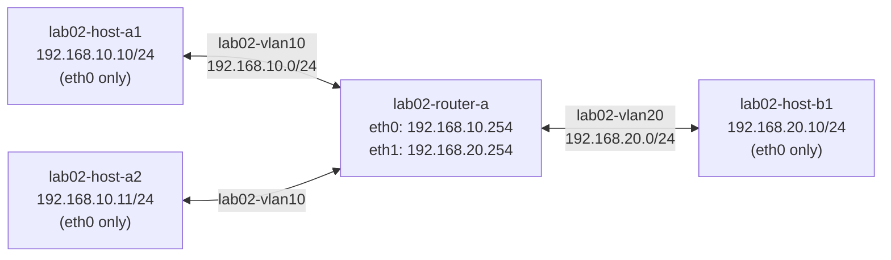

# Lab 02 — L2 vs L3 VLANs

## Objectives

- Observe that hosts on the same L2 segment communicate without a router
- Observe that hosts on different L3 segments require a router
- Understand what an SVI (Switched Virtual Interface) is
- Understand why you cannot extend one subnet across two physically separate segments — the split-subnet problem that VXLAN solves in Lab 09

## Concepts

A **Podman network** behaves like a VLAN: all containers on the same network share a
broadcast domain and can talk directly at L2 (via ARP). No routing needed.

When two containers are on **different** Podman networks, they're in different broadcast
domains. ARP requests don't cross network boundaries; packets need a router to forward
them between subnets.

An **SVI** (Switched Virtual Interface) is the router's interface into a VLAN — the
gateway IP that hosts in that VLAN use to reach other subnets. In this lab, lab02-router-a
has one SVI on each network.

**The split-subnet problem:** What if two physically separate segments are both supposed
to be part of the same /24? For example, 192.168.10.x on two different switches in
two different data center racks. ARP requests from a host on one segment never reach
hosts on the other. A router *routes* (it doesn't bridge at L2) — so adding a router
doesn't solve this; routing within a subnet is a misconfiguration. The real solution
is to extend the L2 domain across the physical gap using a tunnel — VXLAN (Lab 09).

## Containers in This Lab

Four containers run for the full duration. **lab02-host-a1 has a single interface (eth0)**
connected to `lab02-vlan10`. It appears in both Part 1 and Part 2 because it is the same
container reused across exercises — not two separate machines.

| Container | Interface | IP | Network |
|-----------|-----------|-----|---------|
| lab02-host-a1 | eth0 | 192.168.10.10 | lab02-vlan10 |
| lab02-host-a2 | eth0 | 192.168.10.11 | lab02-vlan10 |
| lab02-host-b1 | eth0 | 192.168.20.10 | lab02-vlan20 |
| lab02-router-a | eth0 | 192.168.10.254 | lab02-vlan10 |
| lab02-router-a | eth1 | 192.168.20.254 | lab02-vlan20 |

`lab02-router-a` is the only container with two interfaces. Its eth0 is the gateway for
vlan10 hosts; its eth1 is the gateway for vlan20 hosts.

## Topology

**Part 1 — L2: same broadcast domain, no router needed**

```
lab02-host-a1 (192.168.10.10) ──┐
                                  ├── lab02-vlan10 (192.168.10.0/24)
lab02-host-a2 (192.168.10.11) ──┘
```

Both hosts share one Podman network. ARP resolves directly — no router involved.

**Part 2 — L3: different subnets, router required**

```
lab02-host-a1 (192.168.10.10) ──┐
                                  ├── lab02-vlan10 ──── lab02-router-a ──── lab02-vlan20 ──── lab02-host-b1 (192.168.20.10)
lab02-host-a2 (192.168.10.11) ──┘     192.168.10.0/24   .254  .254    192.168.20.0/24
```

`host-a1` and `host-b1` are on different subnets. Traffic must hop through `router-a`.



## Setup

```bash
./setup.sh
```

Four containers start: lab02-host-a1, lab02-host-a2, lab02-host-b1, lab02-router-a.

Wait 5 seconds for FRR to initialize before running verification commands.

## Exercises

**Part 1 — L2: same VLAN, no router needed**

```bash
podman exec lab02-host-a1 ping -c 5 192.168.10.11
```

Expected: `!!!!!` — no router needed, they share the same Podman network.

```bash
# Watch ARP in action with the debug container
podman run --rm -it \
  --cap-add NET_RAW \
  --network container:lab02-host-a1 \
  docker.io/nicolaka/netshoot bash
# Inside: tcpdump -i eth0 arp
# In another terminal: podman exec lab02-host-a1 ping -c 5 192.168.10.11
# You'll see ARP request + reply — L2 resolution, no routing hop
```

**Part 2 — L3: different VLANs, routing required**

```bash
podman exec lab02-host-a1 ping -c 5 192.168.20.10
```

lab02-host-a1 has no route to 192.168.20.0/24. Add static routes:

```bash
podman exec -i lab02-host-a1 vtysh << 'EOF'
configure terminal
ip route 192.168.20.0/24 192.168.10.254
end
write memory
EOF

podman exec -i lab02-host-b1 vtysh << 'EOF'
configure terminal
ip route 192.168.10.0/24 192.168.20.254
end
write memory
EOF
```

```bash
podman exec lab02-host-a1 ping -c 5 192.168.20.10
```

Expected: `!!!!!`. The packet now hops through lab02-router-a.

```bash
# Confirm the routing hop
podman run --rm -it --cap-add NET_RAW --network container:lab02-host-a1 \
  docker.io/nicolaka/netshoot bash
# Inside: traceroute 192.168.20.10
```

Expected output:
```
 1  192.168.10.254  0.x ms   ← lab02-router-a's eth0 (its SVI on vlan10)
 2  192.168.20.10  0.x ms   ← lab02-host-b1, the destination
```

Reading the output:
- **Hop 1 — `192.168.10.254`**: This is `lab02-router-a`'s address on vlan10 — the default
  gateway for `host-a1`. Because `192.168.20.10` is on a different subnet, `host-a1`
  forwards the packet to its gateway instead of trying to ARP for it directly.
- **Hop 2 — `192.168.20.10`**: The router received the packet on eth0 (vlan10), looked up
  the destination in its routing table, found `192.168.20.0/24` is directly connected on
  eth1 (vlan20), and forwarded it. `host-b1` is the final destination.

The container ID shown as the hostname (e.g. `0ed62b5bf7c7`) is normal — FRR uses the
container ID as the hostname unless you configure one explicitly.

**Part 3 — The split-subnet problem**

Imagine two hosts that *should* share the same subnet (`192.168.10.0/24`) but are
connected to different physical (or virtual) segments. ARP broadcasts don't cross
segment boundaries, so they can never find each other — even though their addresses
suggest they're neighbours.

You can observe this failure right now without reconfiguring anything. `host-b1` is
on `lab02-vlan20` (`192.168.20.10`). Try to ping an address in `192.168.10.0/24`
that doesn't exist on `vlan10`:

```bash
podman exec lab02-host-a1 ping -c 3 192.168.10.99
```

Expected: no reply. `host-a1` broadcasts an ARP request for `192.168.10.99` on
`vlan10`. No host on `vlan10` has that address, so ARP gets no answer, and the ping
fails immediately with `Destination Host Unreachable`.

Now imagine `host-b1` *was* configured as `192.168.10.99` but on `vlan20`. The ARP
broadcast from `host-a1` still never reaches it — it's on a different segment. The
ping would fail for exactly the same reason, even though the addresses look like they
belong together.

Key takeaways:
- Subnets are not just address ranges — they are **broadcast domains**. Hosts must
  share the same broadcast domain to ARP for each other.
- A router cannot fix this: routing is between subnets, not within one.
- The only fix is to extend the L2 domain across the gap — which is what VXLAN does
  (Lab 09).

## Verification

```bash
# Part 1: same-segment ping
podman exec lab02-host-a1 ping -c 5 192.168.10.11
# Expected: 5/5 success, no routing hop

# Part 2: cross-segment ping (after adding static routes)
podman exec lab02-host-a1 ping -c 5 192.168.20.10
# Expected: 5/5 success

# SVI interfaces on lab02-router-a
podman exec lab02-router-a vtysh -c "show interface brief"
# Expected: eth0 192.168.10.254/24 up, eth1 192.168.20.254/24 up
```

## Troubleshooting

**Cross-segment ping fails after adding routes:**
Verify both hosts have return routes:
```bash
podman exec -it lab02-host-a1 vtysh -c "show ip route"
podman exec -it lab02-host-b1 vtysh -c "show ip route"
```

**Debug container for ARP capture:**
```bash
podman run --rm -it --cap-add NET_RAW --network lab02-vlan10 \
  docker.io/nicolaka/netshoot bash
# Inside: tcpdump -i eth0 arp -n
```

**topology-watch or packet-watch port already in use:**
```bash
pkill -f topology_watch; pkill -f packet_watch
./setup.sh
```
