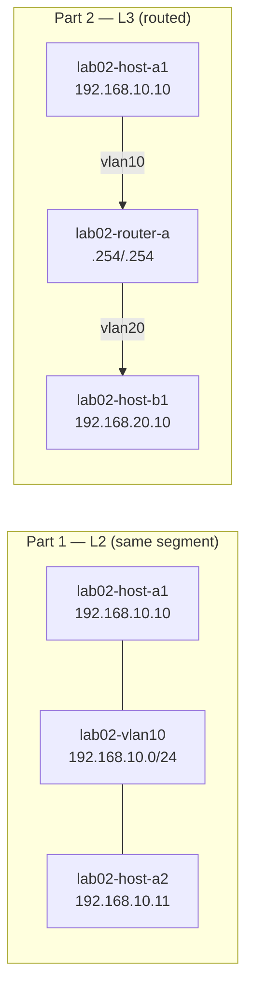

# Lab 02 — L2 vs L3 VLANs

## Objectives

- Observe that hosts on the same L2 segment communicate without a router
- Observe that hosts on different L3 segments require a router
- Understand what an SVI (Switched Virtual Interface) is
- Understand why you cannot extend one subnet across two physically separate segments — the split-subnet problem that VXLAN solves in Lab 09

## Concepts

A **Podman network** behaves like a VLAN: all containers on the same network share a
broadcast domain and can talk directly at L2 (via ARP). No routing needed.

When two containers are on **different** Podman networks, they're in different broadcast
domains. ARP requests don't cross network boundaries; packets need a router to forward
them between subnets.

An **SVI** (Switched Virtual Interface) is the router's interface into a VLAN — the
gateway IP that hosts in that VLAN use to reach other subnets. In this lab, lab02-router-a
has one SVI on each network.

**The split-subnet problem:** What if two physically separate segments are both supposed
to be part of the same /24? For example, 192.168.10.x on two different switches in
two different data center racks. ARP requests from a host on one segment never reach
hosts on the other. A router *routes* (it doesn't bridge at L2) — so adding a router
doesn't solve this; routing within a subnet is a misconfiguration. The real solution
is to extend the L2 domain across the physical gap using a tunnel — VXLAN (Lab 09).

## Topology

```
PART 1 — L2: same broadcast domain (no router needed)
[lab02-host-a1: 192.168.10.10]──┐
                                  ├── lab02-vlan10 (192.168.10.0/24)
[lab02-host-a2: 192.168.10.11]──┘

PART 2 — L3: different subnets (SVI router required)
[lab02-host-a1: 192.168.10.10]──lab02-vlan10──[lab02-router-a]──lab02-vlan20──[lab02-host-b1: 192.168.20.10]
                                               192.168.10.254  192.168.20.254

PART 3 — Split-subnet problem (discussion)
Two hosts that should be on 192.168.10.0/24 are on separate Podman networks.
ARP cannot cross the boundary. VXLAN (Lab 09) is the solution.
```



## Setup

```bash
./setup.sh
```

Four containers start: lab02-host-a1, lab02-host-a2, lab02-host-b1, lab02-router-a.
topology-watch opens at http://localhost:8302.

Wait 5 seconds for FRR to initialize before running verification commands.

## Exercises

**Part 1 — L2: same VLAN, no router needed**

```bash
podman exec -it lab02-host-a1 vtysh -c "ping 192.168.10.11"
```

Expected: `!!!!!` — no router needed, they share the same Podman network.

```bash
# Watch ARP in action with the debug container
podman run --rm -it \
  --network container:lab02-host-a1 \
  ghcr.io/container-images/debugging-tools bash
# Inside: tcpdump -i eth0 arp
# In another terminal: podman exec lab02-host-a1 vtysh -c "ping 192.168.10.11"
# You'll see ARP request + reply — L2 resolution, no routing hop
```

**Part 2 — L3: different VLANs, routing required**

```bash
podman exec -it lab02-host-a1 vtysh -c "ping 192.168.20.10"
```

lab02-host-a1 has no route to 192.168.20.0/24. Add static routes:

```bash
podman exec -it lab02-host-a1 vtysh << 'EOF'
configure terminal
ip route 192.168.20.0/24 192.168.10.254
end
write memory
EOF

podman exec -it lab02-host-b1 vtysh << 'EOF'
configure terminal
ip route 192.168.10.0/24 192.168.20.254
end
write memory
EOF
```

```bash
podman exec -it lab02-host-a1 vtysh -c "ping 192.168.20.10"
```

Expected: `!!!!!`. The packet now hops through lab02-router-a.

```bash
# Confirm the routing hop
podman run --rm -it --network container:lab02-host-a1 \
  ghcr.io/container-images/debugging-tools bash
# Inside: traceroute 192.168.20.10
# Output: 192.168.10.254 (lab02-router-a) then 192.168.20.10 (lab02-host-b1)
```

**Part 3 — The split-subnet problem**

Imagine lab02-host-a1 and lab02-host-b1 were both configured with addresses in
192.168.10.0/24 but connected to different Podman networks (different broadcast domains).

- lab02-host-a1 sends ARP "Who has 192.168.10.20?" — but the other host is on a
  different network and never sees the broadcast. ARP fails. Ping fails.
- Adding a router doesn't help: the router *routes* between different subnets, it
  cannot bridge two separate segments of the *same* subnet without tunneling.
- The fix: extend the L2 domain across the physical gap using VXLAN (Lab 09).

## Verification

```bash
# Part 1: same-segment ping
podman exec -it lab02-host-a1 vtysh -c "ping 192.168.10.11"
# Expected: 5/5 success, no routing hop

# Part 2: cross-segment ping (after adding static routes)
podman exec -it lab02-host-a1 vtysh -c "ping 192.168.20.10"
# Expected: 5/5 success

# SVI interfaces on lab02-router-a
podman exec -it lab02-router-a vtysh -c "show ip interface brief"
# Expected: eth0 192.168.10.254/24 up, eth1 192.168.20.254/24 up
```

## Troubleshooting

**Cross-segment ping fails after adding routes:**
Verify both hosts have return routes:
```bash
podman exec -it lab02-host-a1 vtysh -c "show ip route"
podman exec -it lab02-host-b1 vtysh -c "show ip route"
```

**Debug container for ARP capture:**
```bash
podman run --rm -it --network lab02-vlan10 \
  ghcr.io/container-images/debugging-tools bash
# Inside: tcpdump -i eth0 arp -n
```

**topology-watch or packet-watch port already in use:**
```bash
pkill -f topology_watch; pkill -f packet_watch
./setup.sh
```
