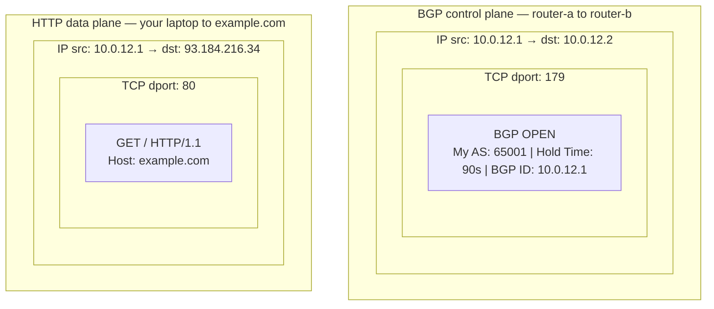
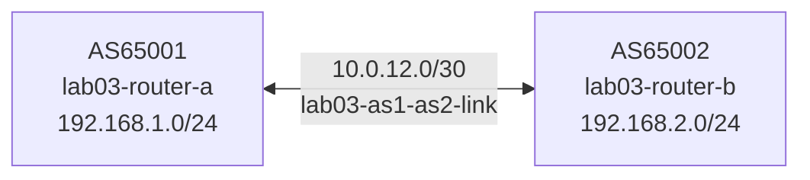

# Lab 03 — Hello BGP

## Objectives

- Configure your first eBGP session between two routers in different autonomous systems
- Watch the BGP Finite State Machine (FSM) progress through its states
- Advertise a prefix and verify it appears in the peer's BGP table
- See BGP OPEN and UPDATE messages in packet-watch

## Concepts

**[BGP](https://en.wikipedia.org/wiki/Border_Gateway_Protocol)** (Border Gateway Protocol) is the routing protocol that connects autonomous
systems on the internet.

An **AS (Autonomous System)** is a network under a single administrative control —
one organization's routers, prefixes, and routing policy. Think of it as a country:
it has its own internal rules, and BGP is the diplomacy between countries. Examples:

- Your ISP's network is an AS
- A cloud provider (AWS, Google) is an AS
- A large university or enterprise with its own IP addresses is an AS

Every AS is identified by an **ASN (Autonomous System Number)** — a globally unique
number assigned by a regional internet registry (ARIN, RIPE, etc.). In these labs
we use private ASNs in the 64512–65534 range (like 65001, 65002) — the same range
you'd use in a lab or behind a private network, never on the public internet.

BGP routers form **sessions** over TCP port 179. BGP is just a TCP application —
the same way a browser sends HTTP over TCP port 80, a router sends BGP messages
over TCP port 179. The packet structure is identical in both cases:



BGP is the **control plane** — routers use it to tell each other which prefixes they
can reach. HTTP is the **data plane** — actual user traffic flowing along the paths
BGP established. Both are just TCP applications; only the port number and the payload
differ.

Before exchanging routes, BGP goes through a handshake defined by the BGP Finite State Machine:

```
Idle → Connect → Active → OpenSent → OpenConfirm → Established
```

- **Idle**: BGP is not trying to connect
- **Connect**: TCP connection being initiated
- **Active**: TCP connected; waiting for OPEN message
- **OpenSent**: OPEN message sent; waiting for peer's OPEN
- **OpenConfirm**: both OPENs received; waiting for KEEPALIVE
- **Established**: session up; routes are being exchanged

Once **Established**, routers exchange **UPDATE** messages containing NLRIs
(Network Layer Reachability Information) — the prefixes being advertised and
the path attributes (AS_PATH, NEXT_HOP, etc.) attached to them.

**eBGP** (external BGP) connects routers in *different* ASes. The peer's ASN is
specified in `remote-as`.

## Topology

```
[AS65001 lab03-router-a]──10.0.12.0/30 (lab03-as1-as2-link)──[lab03-router-b AS65002]
  192.168.1.0/24                                               192.168.2.0/24
  (lab03-as1-internal)                                         (lab03-as2-internal)

router-a: eth0=10.0.12.1/30, eth1=192.168.1.1/24
router-b: eth0=10.0.12.2/30, eth1=192.168.2.1/24
```



lab03-router-a is pre-configured. lab03-router-b has TODO gaps for you to fill in.

## Setup

```bash
./setup.sh
```

Two containers start. topology-watch opens at http://localhost:8303.
lab03-router-b's BGP session will show as red (Idle) until you configure it.

Wait 5 seconds for FRR to initialize before running verification commands.

## Exercises

**Exercise 1: Inspect lab03-router-a's config**

```bash
podman exec -it lab03-router-a vtysh -c "show running-config"
```

You'll see output like this — here's what each line means:

```
frr version 8.5.3           ← FRR daemon version
frr defaults traditional    ← use IOS-style defaults (not OpenBSD-style)
hostname 56ea53edd6de       ← container ID used as hostname (no name configured)
no ipv6 forwarding          ← disable IPv6 to keep the lab simple
!
interface eth0
 ip address 10.0.12.1/30   ← eth0 is on the transit link to router-b; /30 = 4 IPs, 2 usable
exit
!
interface eth1
 ip address 192.168.1.1/24 ← eth1 is the internal network router-a is advertising
exit
!
router bgp 65001            ← start BGP process; this router's ASN is 65001
 bgp router-id 10.0.12.1   ← unique ID for this router in BGP (usually its IP)
 no bgp ebgp-requires-policy ← FRR default blocks all routes without explicit policy;
                               this disables that so routes flow freely in the lab
 neighbor 10.0.12.2 remote-as 65002  ← peer with router-b (10.0.12.2) which is in AS65002
 !
 address-family ipv4 unicast         ← the following applies to IPv4 routes
  network 192.168.1.0/24            ← advertise this prefix to BGP peers
 exit-address-family
exit
```

The `network` statement tells BGP to advertise `192.168.1.0/24` to its peers — but only
if that prefix already exists in the routing table (as a connected route on eth1). BGP
will not invent routes; it only announces what the router actually has.

**Exercise 2: Configure lab03-router-b**

Apply the config live — no restart needed, and you'll see topology-watch react in real time:

```bash
podman exec -i lab03-router-b vtysh << 'EOF'
configure terminal
router bgp 65002
 neighbor 10.0.12.1 remote-as 65001
 address-family ipv4 unicast
  neighbor 10.0.12.1 activate
  network 192.168.2.0/24
 exit-address-family
end
write memory
EOF
```

What each line does:

| Line | Meaning |
|------|---------|
| `neighbor 10.0.12.1 remote-as 65001` | Peer with router-a (10.0.12.1) which is in AS65001 |
| `neighbor 10.0.12.1 activate` | Enable the neighbor in the IPv4 unicast address family (required before routes are exchanged) |
| `network 192.168.2.0/24` | Advertise router-b's internal prefix to its BGP peers |

**Exercise 3: Watch the session come up**

Watch packet-watch for OPEN messages on the lab03-as1-as2-link.
Watch topology-watch at http://localhost:8303: the edge should turn yellow (Active)
then green (Established).

```bash
podman exec -it lab03-router-a vtysh -c "show bgp summary"
```

You'll see output like this:

```
IPv4 Unicast Summary (VRF default):
BGP router identifier 10.0.12.1, local AS number 65001 vrf-id 0
BGP table version 2
RIB entries 3, using 576 bytes of memory
Peers 1, using 29 KiB of memory

Neighbor   V    AS  MsgRcvd  MsgSent  TblVer  InQ OutQ  Up/Down  State/PfxRcd  PfxSnt
10.0.12.2  4  65002      6        6       2    0    0   00:01:23            1       1
```

Column by column:

| Column | Meaning |
|--------|---------|
| `Neighbor` | The peer's IP address — router-b's address on the shared link |
| `V` | BGP version — always 4 (BGP-4 is the only version in use today) |
| `AS` | The peer's ASN — 65002 (router-b) |
| `MsgRcvd / MsgSent` | Total BGP messages received and sent (OPENs + KEEPALIVEs + UPDATEs) |
| `TblVer` | BGP table version — increments each time a route changes |
| `InQ / OutQ` | Messages queued waiting to be processed/sent — should be 0 in steady state |
| `Up/Down` | How long the session has been in its current state |
| `State/PfxRcd` | If a number: session is **Established** and that many prefixes were received. If a word (Idle, Active…): session is not up — that's the FSM state |
| `PfxSnt` | Prefixes sent to this peer |

The `State/PfxRcd` column is the most important: `1` means Established and one prefix received — router-b's `192.168.2.0/24`.

**Exercise 4: Verify route advertisement**

```bash
podman exec -it lab03-router-a vtysh -c "show ip bgp"
```

Output on router-a:
```
    Network          Next Hop            Metric LocPrf Weight Path
 *> 192.168.1.0/24   0.0.0.0                  0         32768 i
 *> 192.168.2.0/24   10.0.12.2                0             0 65002 i
```

Reading the columns:

| Column | Meaning |
|--------|---------|
| `*` | Route is **valid** — next-hop is reachable |
| `>` | Route is the **best path** — the one installed in the forwarding table |
| `Network` | The prefix |
| `Next Hop` | Where to send traffic for this prefix. `0.0.0.0` means the prefix is **locally originated** (this router owns it) |
| `Metric` | The MED (Multi-Exit Discriminator) — hint to peers about preferred entry point; 0 means not set |
| `LocPrf` | LOCAL_PREF — used to prefer paths within an AS; blank means it came from eBGP (covered in Lab 08) |
| `Weight` | Cisco/FRR local preference (higher = preferred); `32768` is the default for locally originated routes, `0` for learned routes |
| `Path` | The **AS_PATH** — list of ASes the route has traversed. `65002 i` means it was originated (`i` = IGP) inside AS65002 |

What you're seeing:
- `192.168.1.0/24  0.0.0.0  32768 i` — router-a's own prefix, locally originated, weight 32768
- `192.168.2.0/24  10.0.12.2  65002 i` — learned from router-b (next-hop 10.0.12.2), originated in AS65002

Router-b's table is the mirror image: it locally originates `192.168.2.0/24` and learned `192.168.1.0/24` from router-a with AS_PATH `65001`.

```bash
podman exec -it lab03-router-b vtysh -c "show ip bgp"
```

## Verification

```bash
# Both sessions established
podman exec -it lab03-router-a vtysh -c "show bgp summary"
# Expected: 10.0.12.2, state=Established, PfxRcd=1

podman exec -it lab03-router-b vtysh -c "show bgp summary"
# Expected: 10.0.12.1, state=Established, PfxRcd=1

# Routes in BGP table
podman exec -it lab03-router-a vtysh -c "show ip bgp 192.168.2.0/24"
# Expected: route present, AS_PATH 65002

# TCP session on port 179
podman run --rm -it --network container:lab03-router-a \
  docker.io/nicolaka/netshoot bash
# Inside: ss -tnp | grep 179
```

## Troubleshooting

**`write memory` warns "Error renaming frr.conf.sav: Device or resource busy":**
Harmless. FRR cannot rename the bind-mounted config file before rewriting it, but the config is written and routes are installed correctly. The `[OK]` line confirms success.

**Session stays in Active (never reaches Established):**
Check that both neighbor statements reference the *other* router's IP:
- lab03-router-a: `neighbor 10.0.12.2 remote-as 65002`
- lab03-router-b: `neighbor 10.0.12.1 remote-as 65001`

Check that `remote-as` values match the other router's actual AS number.

**Route not in peer's BGP table:**
Verify `network` statement matches an exact prefix installed in the local routing table:
```bash
podman exec -it lab03-router-b vtysh -c "show ip route 192.168.2.0/24"
```
The prefix must appear as a connected or static route before BGP will advertise it.

**Config change doesn't take effect:**
After editing `configs/router-b.conf`, the running container doesn't reload automatically.
Either apply changes via `vtysh` (Exercise 2 above) or restart the container:
```bash
podman restart lab03-router-b
```
Wait 5 seconds after restart for FRR to reinitialize.

**Enable BGP debug logging to diagnose session problems:**

```bash
podman exec -i lab03-router-b vtysh << 'EOF'
debug bgp neighbor-events
debug bgp updates
terminal monitor
EOF
```

`terminal monitor` sends log output to your vtysh session in real time. You'll see
messages like `BGP: lab03-router-b rcvd OPEN` and `BGP: lab03-router-b sending KEEPALIVE`.

To watch logs from the container itself (FRR writes to syslog, captured by Podman):
```bash
podman logs -f lab03-router-b
```

To disable debug logging (reduces noise once the session is up):
```bash
podman exec -it lab03-router-b vtysh -c "no debug bgp neighbor-events"
podman exec -it lab03-router-b vtysh -c "no debug bgp updates"
```

**BGP session flaps (goes up and comes down):**
FRR sends KEEPALIVE every 30s (default hold timer: 90s). If you see repeated OPEN
messages in packet-watch, the session is resetting — likely a config mismatch.
```bash
podman exec -it lab03-router-a vtysh -c "show bgp neighbors 10.0.12.2"
# Look for: "BGP state = Active, Last reset reason"
```

**topology-watch or packet-watch port already in use:**
```bash
pkill -f topology_watch; pkill -f packet_watch
./setup.sh
```
