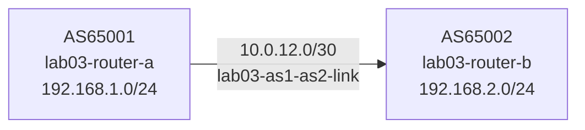

# Lab 03 — Hello BGP

## Objectives

- Configure your first eBGP session between two routers in different autonomous systems
- Watch the BGP Finite State Machine (FSM) progress through its states
- Advertise a prefix and verify it appears in the peer's BGP table
- See BGP OPEN and UPDATE messages in packet-watch

## Concepts

**BGP** (Border Gateway Protocol) is the routing protocol that connects autonomous
systems on the internet. Each network operator runs their own AS (Autonomous System),
identified by an ASN (Autonomous System Number).

BGP routers form **sessions** over TCP port 179. Before exchanging routes, they go
through a handshake defined by the BGP Finite State Machine:

```
Idle → Connect → Active → OpenSent → OpenConfirm → Established
```

- **Idle**: BGP is not trying to connect
- **Connect**: TCP connection being initiated
- **Active**: TCP connected; waiting for OPEN message
- **OpenSent**: OPEN message sent; waiting for peer's OPEN
- **OpenConfirm**: both OPENs received; waiting for KEEPALIVE
- **Established**: session up; routes are being exchanged

Once **Established**, routers exchange **UPDATE** messages containing NLRIs
(Network Layer Reachability Information) — the prefixes being advertised and
the path attributes (AS_PATH, NEXT_HOP, etc.) attached to them.

**eBGP** (external BGP) connects routers in *different* ASes. The peer's ASN is
specified in `remote-as`.

## Topology

```
[AS65001 lab03-router-a]──10.0.12.0/30 (lab03-as1-as2-link)──[lab03-router-b AS65002]
  192.168.1.0/24                                               192.168.2.0/24
  (lab03-as1-internal)                                         (lab03-as2-internal)

router-a: eth0=10.0.12.1/30, eth1=192.168.1.1/24
router-b: eth0=10.0.12.2/30, eth1=192.168.2.1/24
```



lab03-router-a is pre-configured. lab03-router-b has TODO gaps for you to fill in.

## Setup

```bash
./setup.sh
```

Two containers start. topology-watch opens at http://localhost:8303.
lab03-router-b's BGP session will show as red (Idle) until you configure it.

Wait 5 seconds for FRR to initialize before running verification commands.

## Exercises

**Exercise 1: Inspect lab03-router-a's config**

```bash
podman exec -it lab03-router-a vtysh -c "show running-config"
```

Note the neighbor statement: `neighbor 10.0.12.2 remote-as 65002`
Note the network advertisement: `network 192.168.1.0/24`

**Exercise 2: Configure lab03-router-b**

Edit `configs/router-b.conf` — fill in the two TODO sections:

```
 neighbor 10.0.12.1 remote-as 65001
 ...
  neighbor 10.0.12.1 activate
  network 192.168.2.0/24
```

Apply the config without restarting:
```bash
podman exec -it lab03-router-b vtysh << 'EOF'
configure terminal
router bgp 65002
 neighbor 10.0.12.1 remote-as 65001
 address-family ipv4 unicast
  neighbor 10.0.12.1 activate
  network 192.168.2.0/24
 exit-address-family
end
write memory
EOF
```

**Exercise 3: Watch the session come up**

Watch packet-watch for OPEN messages on the lab03-as1-as2-link.
Watch topology-watch at http://localhost:8303: the edge should turn yellow (Active)
then green (Established).

```bash
podman exec -it lab03-router-a vtysh -c "show bgp summary"
```

Expected: `Established` state, `1` prefix received.

**Exercise 4: Verify route advertisement**

```bash
# On lab03-router-a: see lab03-router-b's advertised prefix
podman exec -it lab03-router-a vtysh -c "show ip bgp"
# Expected: 192.168.2.0/24 with NEXT_HOP=10.0.12.2, AS_PATH=65002

# On lab03-router-b: see lab03-router-a's advertised prefix
podman exec -it lab03-router-b vtysh -c "show ip bgp"
# Expected: 192.168.1.0/24 with NEXT_HOP=10.0.12.1, AS_PATH=65001
```

## Verification

```bash
# Both sessions established
podman exec -it lab03-router-a vtysh -c "show bgp summary"
# Expected: 10.0.12.2, state=Established, PfxRcd=1

podman exec -it lab03-router-b vtysh -c "show bgp summary"
# Expected: 10.0.12.1, state=Established, PfxRcd=1

# Routes in BGP table
podman exec -it lab03-router-a vtysh -c "show ip bgp 192.168.2.0/24"
# Expected: route present, AS_PATH 65002

# TCP session on port 179
podman run --rm -it --network container:lab03-router-a \
  docker.io/nicolaka/netshoot bash
# Inside: ss -tnp | grep 179
```

## Troubleshooting

**Session stays in Active (never reaches Established):**
Check that both neighbor statements reference the *other* router's IP:
- lab03-router-a: `neighbor 10.0.12.2 remote-as 65002`
- lab03-router-b: `neighbor 10.0.12.1 remote-as 65001`

Check that `remote-as` values match the other router's actual AS number.

**Route not in peer's BGP table:**
Verify `network` statement matches an exact prefix installed in the local routing table:
```bash
podman exec -it lab03-router-b vtysh -c "show ip route 192.168.2.0/24"
```
The prefix must appear as a connected or static route before BGP will advertise it.

**Config change doesn't take effect:**
After editing `configs/router-b.conf`, the running container doesn't reload automatically.
Either apply changes via `vtysh` (Exercise 2 above) or restart the container:
```bash
podman restart lab03-router-b
```
Wait 5 seconds after restart for FRR to reinitialize.

**Enable BGP debug logging to diagnose session problems:**

```bash
podman exec -it lab03-router-b vtysh << 'EOF'
debug bgp neighbor-events
debug bgp updates
terminal monitor
EOF
```

`terminal monitor` sends log output to your vtysh session in real time. You'll see
messages like `BGP: lab03-router-b rcvd OPEN` and `BGP: lab03-router-b sending KEEPALIVE`.

To watch logs from the container itself (FRR writes to syslog, captured by Podman):
```bash
podman logs -f lab03-router-b
```

To disable debug logging (reduces noise once the session is up):
```bash
podman exec -it lab03-router-b vtysh -c "no debug bgp neighbor-events"
podman exec -it lab03-router-b vtysh -c "no debug bgp updates"
```

**BGP session flaps (goes up and comes down):**
FRR sends KEEPALIVE every 30s (default hold timer: 90s). If you see repeated OPEN
messages in packet-watch, the session is resetting — likely a config mismatch.
```bash
podman exec -it lab03-router-a vtysh -c "show bgp neighbors 10.0.12.2"
# Look for: "BGP state = Active, Last reset reason"
```

**topology-watch or packet-watch port already in use:**
```bash
pkill -f topology_watch; pkill -f packet_watch
./setup.sh
```
