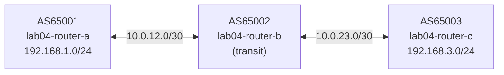

# Lab 04 — Transit

## Objectives

- Understand how a transit AS forwards routes between two customer ASes
- Configure eBGP sessions on both sides of a transit provider
- Learn why `next-hop-self` is required on transit BGP sessions
- Verify end-to-end reachability across multiple autonomous systems

## Concepts

**Transit routing** is the core business of the internet backbone. A transit AS
(here, AS65002) has peering sessions with multiple other ASes and forwards their
routes to each other — for a fee in the real world.

The key detail in transit routing is **NEXT_HOP handling**. When router-b
receives a prefix from router-a with `NEXT_HOP=10.0.12.1` and re-advertises
it to router-c, what next-hop does router-c see?

For eBGP sessions, BGP's default behavior is to set NEXT_HOP to the
advertising router's own address on the outgoing link. So router-c sees
`NEXT_HOP=10.0.23.1` (router-b's address) — which is directly reachable.

**`next-hop-self`** makes this explicit. It matters most when AS65002 grows
to have multiple routers connected via iBGP: without it, a border router
re-advertising a route to an iBGP peer would leave the original NEXT_HOP
(`10.0.12.1`) unchanged — and that iBGP peer can't reach it. Configuring
`next-hop-self` on transit sessions is therefore a best practice even when
it isn't strictly required in a single-router AS.

**AS_PATH** grows with each transit hop. When router-c receives
192.168.1.0/24, the path reads `65002 65001` — it can see exactly
which ASes the route passed through.

**One router per AS — a simplification:** In these labs each AS contains
exactly one router. In a real network, an AS typically has many routers
(edge, core, border routers). When multiple routers share an AS, they need
to exchange BGP routes *with each other* — that's **iBGP** (internal BGP).
Unlike eBGP which connects different ASes, iBGP connects routers *inside*
the same AS. Without iBGP, a border router that learns a prefix from an
eBGP peer has no way to tell its iBGP neighbors about it, so traffic
black-holes inside the AS. A future lab covers iBGP, full-mesh
requirements, and route reflectors.

## Topology



**What's pre-configured vs. what you build:**

- **router-a** — fully configured: BGP session to router-b, advertising `192.168.1.0/24`
- **router-b** — interfaces only: no BGP process — you configure everything (both neighbors, `next-hop-self`, nothing else needed)
- **router-c** — fully configured: BGP session to router-b, advertising `192.168.3.0/24`

You configure only router-b. router-a and router-c are already waiting to peer with it — both links start yellow (Active) before Exercise 2. The key challenge: without `next-hop-self` on router-b, router-c learns router-a's prefix but the next-hop IP (`10.0.12.1`) is unreachable from router-c — the route is invalid. Adding `next-hop-self` tells router-b to rewrite the next-hop to its own address so router-c can actually use the route.

## Setup

```bash
./setup.sh
```

Three containers start. Both links show as yellow (Active) — router-a and router-c are
already configured and trying to reach router-b, but router-b has no BGP process yet.
After Exercise 2, both links turn green simultaneously as router-b's sessions come up
with both waiting peers.

Wait 5 seconds for FRR to initialize before running verification commands.

## Exercises

**Exercise 1: Inspect router-a's config**

```bash
podman exec -it lab04-router-a vtysh -c "show running-config"
```

router-a is fully configured: it peers with 10.0.12.2 (router-b) and advertises
192.168.1.0/24.

**Exercise 2: Configure router-b**

router-b has no BGP process — you configure it from scratch. It needs sessions
with both router-a and router-c, and must use `next-hop-self` on both:

```
neighbor 10.0.12.1 remote-as 65001
neighbor 10.0.23.2 remote-as 65003
...
 neighbor 10.0.12.1 activate
 neighbor 10.0.12.1 next-hop-self
 neighbor 10.0.23.2 activate
 neighbor 10.0.23.2 next-hop-self
```

Apply without restarting:

<details>
<summary>Show command</summary>

```bash
podman exec -i lab04-router-b vtysh << 'EOF'
configure terminal
router bgp 65002
 bgp router-id 10.0.12.2
 no bgp ebgp-requires-policy
 neighbor 10.0.12.1 remote-as 65001
 neighbor 10.0.23.2 remote-as 65003
 address-family ipv4 unicast
  neighbor 10.0.12.1 activate
  neighbor 10.0.12.1 next-hop-self
  neighbor 10.0.23.2 activate
  neighbor 10.0.23.2 next-hop-self
 exit-address-family
end
EOF
```

</details>

**Exercise 3: Verify transit is working**

```bash
podman exec -it lab04-router-b vtysh -c "show bgp summary"
```

You'll see output like this:

```
IPv4 Unicast Summary (VRF default):
BGP router identifier 10.0.12.2, local AS number 65002 vrf-id 0
BGP table version 1
RIB entries 1, using 192 bytes of memory
Peers 2, using 1449 KiB of memory

Neighbor   V    AS  MsgRcvd  MsgSent  TblVer  InQ OutQ  Up/Down  State/PfxRcd  PfxSnt
10.0.12.1  4  65001       6        6       0    0    0  00:02:16            1       1
10.0.23.2  4  65003       3        4       0    0    0  00:00:04            0       1
```

Reading the header:

| Field | Meaning |
|-------|---------|
| `BGP router identifier 10.0.12.2` | Router-b's BGP ID — the IP it uses to identify itself to peers |
| `local AS number 65002` | Router-b is the transit AS |
| `BGP table version 1` | The BGP table has been updated once — when router-a's prefix arrived |
| `RIB entries 1` | Only one prefix is currently in router-b's BGP table (router-a's `192.168.1.0/24`). Router-b has no internal network of its own to originate — it's a pure transit router |
| `Peers 2` | Two established sessions |

Reading the neighbor rows:

| Column | 10.0.12.1 (router-a) | 10.0.23.2 (router-c) |
|--------|----------------------|----------------------|
| `AS` | 65001 — router-a's AS | 65003 — router-c's AS |
| `MsgRcvd / MsgSent` | 6/6 — several KEEPALIVEs have been exchanged | 3/4 — session just started: OPEN + KEEPALIVE + one UPDATE sent |
| `Up/Down` | 2+ minutes — router-a was already configured and waiting; this session came up first | 4 seconds — router-c's session just established |
| `State/PfxRcd` | `1` — Established; received router-a's `192.168.1.0/24` | `0` — Established but no prefix received yet; router-c's UPDATE may not have arrived in the 4 seconds since the session came up |
| `PfxSnt` | `1` — router-b has sent router-c's prefix (once received) to router-a | `1` — router-b sent router-a's `192.168.1.0/24` to router-c |

The `Up/Down` asymmetry is expected: router-a has been configured since container start and was waiting for router-b, so its session established the moment you applied router-b's config. Router-c's session established at the same time but its `Up/Down` clock may show slightly lower depending on TCP handshake timing.

The `PfxRcd=0` from router-c is temporary — give it a few seconds and run the command again. Once router-c's UPDATE arrives, it will flip to `1`.

```bash
# Confirm once both show PfxRcd=1
podman exec -it lab04-router-b vtysh -c "show bgp summary"
```

**Exercise 4: Observe AS_PATH growth**

```bash
podman exec -it lab04-router-c vtysh -c "show ip bgp 192.168.1.0/24"
podman exec -it lab04-router-a vtysh -c "show ip bgp 192.168.3.0/24"
```

Router-c's view of `192.168.1.0/24`:
```
65002 65001
  10.0.23.1 from 10.0.23.1 (10.0.12.2)
    Origin IGP, valid, external, best (First path received)
```

Router-a's view of `192.168.3.0/24`:
```
65002 65003
  10.0.12.2 from 10.0.12.2 (10.0.12.2)
    Origin IGP, valid, external, best (First path received)
```

Reading the output:

| Field | Router-c sees | Router-a sees |
|-------|--------------|--------------|
| AS_PATH | `65002 65001` — route transited AS65002 then originated in AS65001 | `65002 65003` — symmetric path in reverse |
| `NEXT_HOP` | `10.0.23.1` — router-b's address on the link *toward router-c*. This proves `next-hop-self` is working: without it this would show `10.0.12.1` (router-a's address), which router-c has no route to | `10.0.12.2` — router-b's address on the link toward router-a; same principle |
| `from 10.0.23.1 (10.0.12.2)` | The route was received *from* 10.0.23.1 (router-b's eth1 IP). The `(10.0.12.2)` in parentheses is router-b's BGP router-id — a separate identifier, not the next-hop | Same router-b, different interface |
| `valid, external, best` | `valid` = next-hop reachable; `external` = learned via eBGP; `best` = selected as the forwarding path | Same |

**Exercise 5 (challenge): Why next-hop-self doesn't break things here — but matters elsewhere**

Try removing `next-hop-self` on router-b's session toward router-c:

```bash
podman exec -i lab04-router-b vtysh << 'EOF'
configure terminal
router bgp 65002
 address-family ipv4 unicast
  no neighbor 10.0.23.2 next-hop-self
 exit-address-family
end
EOF
podman exec -it lab04-router-b vtysh -c "clear bgp 10.0.23.2 soft out"
podman exec -it lab04-router-c vtysh -c "show ip bgp 192.168.1.0/24"
```

The NEXT_HOP is still `10.0.23.1` — nothing broke. Why?

**eBGP next-hop rule (RFC 4271):** When a router advertises a route to an eBGP
peer, it must set the NEXT_HOP to the IP address of its own interface on the link
to that peer. This happens automatically, regardless of `next-hop-self`. Router-b
rewrites the next-hop to `10.0.23.1` (its eth1 address) whether or not
`next-hop-self` is configured. In a pure eBGP topology, the two are equivalent.

**iBGP next-hop rule (RFC 4271):** When a router re-advertises a route to an
iBGP peer, it must NOT modify the NEXT_HOP. The original next-hop is preserved.
This is where the problem appears.

Imagine AS65002 had two border routers (router-b1 and router-b2) connected via iBGP:

```
AS65001                  AS65002                        AS65003
router-a ──10.0.12.0/30── router-b1 ──iBGP── router-b2 ──10.0.23.0/30── router-c
10.0.12.1                 10.0.12.2           10.0.23.1                   10.0.23.2
```

What happens without `next-hop-self` on the iBGP session:

1. router-a advertises `192.168.1.0/24` to router-b1 via eBGP with `NEXT_HOP=10.0.12.1`
2. router-b1 re-advertises to router-b2 via **iBGP** — iBGP rule: NEXT_HOP is preserved → router-b2 sees `NEXT_HOP=10.0.12.1`
3. router-b2 looks up `10.0.12.1` in its routing table: no route — it's on a link only router-b1 is connected to
4. The route is **invalid**. router-b2 cannot use it. Traffic destined for `192.168.1.0/24` is dropped.

With `next-hop-self` on router-b1's iBGP session to router-b2:

1–2. Same as above, but router-b1 rewrites NEXT_HOP to its own loopback or iBGP peering address (e.g., `10.0.12.2`)
3. router-b2 looks up `10.0.12.2`: directly reachable via iBGP
4. Route installed. Traffic forwarded correctly.

| Session type | Default next-hop behavior | `next-hop-self` effect |
|---|---|---|
| eBGP | Rewritten to local outgoing interface address | No change — already rewritten |
| iBGP | Preserved from original eBGP advertisement | Rewrites to local address — fixes the unreachable next-hop |

This is why `next-hop-self` is configured as a best practice on transit routers: AS65002
has one router today, but when it grows, the iBGP next-hop problem will appear immediately.
Configuring it now costs nothing. The full iBGP scenario is covered in a future lab.

Restore `next-hop-self`:

```bash
podman exec -i lab04-router-b vtysh << 'EOF'
configure terminal
router bgp 65002
 address-family ipv4 unicast
  neighbor 10.0.23.2 next-hop-self
 exit-address-family
end
EOF
```

## Verification

```bash
# All three sessions established
podman exec -it lab04-router-b vtysh -c "show bgp summary"
# Expected: 10.0.12.1 Established PfxRcd=1, 10.0.23.2 Established PfxRcd=1

# Transit routes visible on each end
podman exec -it lab04-router-a vtysh -c "show ip bgp"
# Expected: 192.168.3.0/24 via 10.0.12.2, AS_PATH 65002 65003

podman exec -it lab04-router-c vtysh -c "show ip bgp"
# Expected: 192.168.1.0/24 via 10.0.23.1, AS_PATH 65002 65001

# NEXT_HOP is reachable (next-hop-self working)
podman exec -it lab04-router-c vtysh -c "show ip bgp 192.168.1.0/24"
# NEXT_HOP must be 10.0.23.1, not 10.0.12.1
```

## Troubleshooting

**router-b sessions stay in Active:**
Confirm both neighbor IPs are correct in router-b's config. router-a expects
a peer at 10.0.12.2, so router-b must configure `neighbor 10.0.12.1 remote-as 65001`
(not the other way around).

**Route visible in BGP table but not in routing table (`show ip route`):**
The NEXT_HOP is unreachable. Check that `next-hop-self` is set in the
address-family block for both neighbors on router-b.

**router-c receives a route but it's marked as invalid:**
```bash
podman exec -it lab04-router-c vtysh -c "show ip bgp 192.168.1.0/24"
# Look for "inaccessible" next to the NEXT_HOP line
```
This means router-c cannot reach the NEXT_HOP address. Verify `next-hop-self`
is configured on router-b's session toward router-c.

**Enable BGP debug logging:**
```bash
podman exec -it lab04-router-b vtysh -c "debug bgp neighbor-events" && podman logs -f lab04-router-b
```

**topology-watch or packet-watch port already in use:**
```bash
pkill -f topology_watch; pkill -f packet_watch
./setup.sh
```
