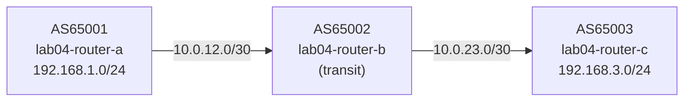

# Lab 04 — Transit

## Objectives

- Understand how a transit AS forwards routes between two customer ASes
- Configure eBGP sessions on both sides of a transit provider
- Learn why `next-hop-self` is required on transit BGP sessions
- Verify end-to-end reachability across multiple autonomous systems

## Concepts

**Transit routing** is the core business of the internet backbone. A transit AS
(here, AS65002) has peering sessions with multiple other ASes and forwards their
routes to each other — for a fee in the real world.

The key challenge: when router-b receives a prefix from router-a with
`NEXT_HOP=10.0.12.1` and advertises it to router-c, router-c has no route to
`10.0.12.1`. The session breaks.

**`next-hop-self`** solves this: the transit router rewrites the NEXT_HOP
attribute to its own address on the outbound interface. Router-c now sees
`NEXT_HOP=10.0.23.1`, which is directly reachable.

```
Without next-hop-self:
  router-c receives 192.168.1.0/24 with NEXT_HOP=10.0.12.1
  router-c: "I have no route to 10.0.12.1" → route unusable

With next-hop-self:
  router-c receives 192.168.1.0/24 with NEXT_HOP=10.0.23.1
  router-c: "10.0.23.1 is directly connected" → route installed
```

**AS_PATH** grows with each transit hop. When router-c receives
192.168.1.0/24, the path reads `65002 65001` — it can see exactly
which ASes the route passed through.

## Topology

```
[AS65001]──10.0.12.0/30──[AS65002 transit]──10.0.23.0/30──[AS65003]
lab04-router-a            lab04-router-b                   lab04-router-c
192.168.1.0/24                                              192.168.3.0/24

router-a: eth0=10.0.12.1/30, eth1=192.168.1.1/24
router-b: eth0=10.0.12.2/30, eth1=10.0.23.1/30
router-c: eth0=10.0.23.2/30, eth1=192.168.3.1/24
```



router-a is pre-configured. router-b and router-c have TODO gaps for you to fill in.

## Setup

```bash
./setup.sh
```

Three containers start. router-b's sessions will show as red (Idle) until you
configure them.

Wait 5 seconds for FRR to initialize before running verification commands.

## Exercises

**Exercise 1: Inspect router-a's config**

```bash
podman exec -it lab04-router-a vtysh -c "show running-config"
```

router-a is fully configured: it peers with 10.0.12.2 (router-b) and advertises
192.168.1.0/24.

**Exercise 2: Configure router-b**

Edit `configs/router-b.conf`. Fill in the TODO sections — router-b needs sessions
with both router-a and router-c, and must use `next-hop-self` on both:

```
neighbor 10.0.12.1 remote-as 65001
neighbor 10.0.23.2 remote-as 65003
...
 neighbor 10.0.12.1 activate
 neighbor 10.0.12.1 next-hop-self
 neighbor 10.0.23.2 activate
 neighbor 10.0.23.2 next-hop-self
```

Apply without restarting:

```bash
podman exec -i lab04-router-b vtysh << 'EOF'
configure terminal
router bgp 65002
 neighbor 10.0.12.1 remote-as 65001
 neighbor 10.0.23.2 remote-as 65003
 address-family ipv4 unicast
  neighbor 10.0.12.1 activate
  neighbor 10.0.12.1 next-hop-self
  neighbor 10.0.23.2 activate
  neighbor 10.0.23.2 next-hop-self
 exit-address-family
end
write memory
EOF
```

**Exercise 3: Configure router-c**

Edit `configs/router-c.conf`. Fill in the TODO sections:

```
neighbor 10.0.23.1 remote-as 65002
...
 neighbor 10.0.23.1 activate
 network 192.168.3.0/24
```

Apply without restarting:

```bash
podman exec -i lab04-router-c vtysh << 'EOF'
configure terminal
router bgp 65003
 neighbor 10.0.23.1 remote-as 65002
 address-family ipv4 unicast
  neighbor 10.0.23.1 activate
  network 192.168.3.0/24
 exit-address-family
end
write memory
EOF
```

**Exercise 4: Verify transit is working**

```bash
# Check both of router-b's sessions
podman exec -it lab04-router-b vtysh -c "show bgp summary"

# Expected: two neighbors, both Established
```

**Exercise 5: Observe AS_PATH growth**

```bash
# On router-c: see router-a's prefix with AS_PATH showing the transit path
podman exec -it lab04-router-c vtysh -c "show ip bgp 192.168.1.0/24"
# Expected: AS_PATH = 65002 65001, NEXT_HOP = 10.0.23.1

# On router-a: see router-c's prefix via transit
podman exec -it lab04-router-a vtysh -c "show ip bgp 192.168.3.0/24"
# Expected: AS_PATH = 65002 65003, NEXT_HOP = 10.0.12.2
```

**Exercise 6 (challenge): Remove next-hop-self and see what breaks**

```bash
podman exec -i lab04-router-b vtysh << 'EOF'
configure terminal
router bgp 65002
 address-family ipv4 unicast
  no neighbor 10.0.23.2 next-hop-self
 exit-address-family
end
EOF

# Now check router-c's BGP table
podman exec -it lab04-router-c vtysh -c "show ip bgp 192.168.1.0/24"
# Expected: route is received but NEXT_HOP=10.0.12.1 is unreachable → unusable
```

Restore after the experiment:

```bash
podman exec -it lab04-router-b vtysh -c "configure terminal" << 'EOF'
router bgp 65002
 address-family ipv4 unicast
  neighbor 10.0.23.2 next-hop-self
 exit-address-family
end
EOF
```

## Verification

```bash
# All three sessions established
podman exec -it lab04-router-b vtysh -c "show bgp summary"
# Expected: 10.0.12.1 Established PfxRcd=1, 10.0.23.2 Established PfxRcd=1

# Transit routes visible on each end
podman exec -it lab04-router-a vtysh -c "show ip bgp"
# Expected: 192.168.3.0/24 via 10.0.12.2, AS_PATH 65002 65003

podman exec -it lab04-router-c vtysh -c "show ip bgp"
# Expected: 192.168.1.0/24 via 10.0.23.1, AS_PATH 65002 65001

# NEXT_HOP is reachable (next-hop-self working)
podman exec -it lab04-router-c vtysh -c "show ip bgp 192.168.1.0/24"
# NEXT_HOP must be 10.0.23.1, not 10.0.12.1
```

## Troubleshooting

**router-b sessions stay in Active:**
Confirm both neighbor IPs are correct in router-b's config. router-a expects
a peer at 10.0.12.2, so router-b must configure `neighbor 10.0.12.1 remote-as 65001`
(not the other way around).

**Route visible in BGP table but not in routing table (`show ip route`):**
The NEXT_HOP is unreachable. Check that `next-hop-self` is set in the
address-family block for both neighbors on router-b.

**router-c receives a route but it's marked as invalid:**
```bash
podman exec -it lab04-router-c vtysh -c "show ip bgp 192.168.1.0/24"
# Look for "inaccessible" next to the NEXT_HOP line
```
This means router-c cannot reach the NEXT_HOP address. Verify `next-hop-self`
is configured on router-b's session toward router-c.

**Enable BGP debug logging:**
```bash
podman exec -it lab04-router-b vtysh -c "debug bgp neighbor-events" && podman logs -f lab04-router-b
```

**topology-watch or packet-watch port already in use:**
```bash
pkill -f topology_watch; pkill -f packet_watch
./setup.sh
```
