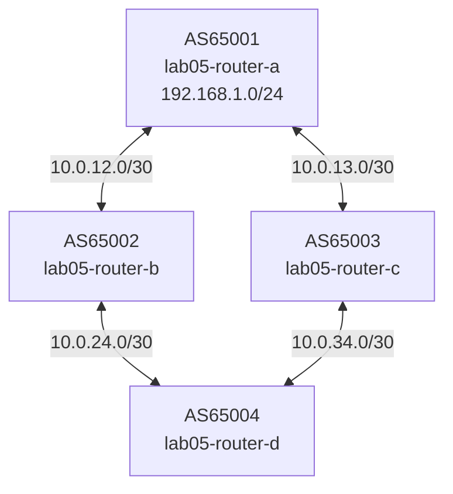

# Lab 05 — Many Paths

## Objectives

- See BGP best-path selection in action when multiple paths exist to the same prefix
- Understand how AS_PATH length influences best-path selection
- Use `show ip bgp` to read the path attributes on competing routes
- Observe what happens when you manipulate LOCAL_PREF and MED

## Concepts

BGP receives routes from multiple peers and must choose one **best path** to
install in the routing table. The **best-path selection algorithm** runs through
a sequence of attributes in order; the first attribute that differs picks the winner.

The most commonly exercised steps (in order):

| Step | Attribute | Who controls it | Rule | Scope |
|------|-----------|----------------|------|-------|
| 1 | **LOCAL_PREF** | Your AS (you set it on inbound routes) | Higher wins | Stays inside your AS — never sent to eBGP peers |
| 2 | **AS_PATH length** | Any AS in the path (via prepending) | Shorter wins | Carried across all eBGP hops |
| 3 | **ORIGIN** | The originating AS | IGP < EGP < incomplete | Rarely changed manually |
| 4 | **MED** | Your neighboring AS (they set it on outbound routes) | Lower wins | Only compared between paths **from the same AS** |
| 5 | **eBGP > iBGP** | Protocol | External wins | — |
| 6 | **IGP metric to NEXT_HOP** | Your IGP | Lower wins | Internal tie-breaker |
| 7 | **Router ID** | The peer | Lower wins | Last-resort tie-breaker |

**LOCAL_PREF vs MED — the key distinction:**

- **LOCAL_PREF** is set *by you* on routes you receive. It tells your own routers
  which path to prefer when you have multiple upstream options. It is never
  advertised to eBGP peers — it's purely internal to your AS.

- **MED** is set *by your neighbor* on routes they send you. It's a hint from
  them about which of their entry points you should use. It is only compared
  between paths that came from the **same neighboring AS** — if router-b (AS65002)
  and router-c (AS65003) are in different ASes, their MEDs are not compared.

In this lab, router-d receives `192.168.1.0/24` via two paths:
- Path via router-b: AS_PATH = `65002 65001`
- Path via router-c: AS_PATH = `65003 65001`

Both paths have the same AS_PATH length (2 hops), equal LOCAL_PREF, and MED
can't be compared (different neighboring ASes). BGP falls to step 7 — **Oldest
route** — and picks whichever path arrived first. This is a timing tiebreaker:
it preserves stability, but you can't rely on it for traffic engineering.
The exercises replace it with explicit policy: AS_PATH prepending (Exercise 2)
and LOCAL_PREF (Exercise 3).

## Topology



All four routers are pre-configured. All sessions come up immediately on `./setup.sh`. The lab is about path selection policy — session setup was covered in Lab 03.

## Setup

```bash
./setup.sh
```

Four containers start with all BGP sessions pre-established. All four links show
green immediately — no configuration needed before the exercises.

Wait 5 seconds for FRR to initialize, then confirm all sessions are up:

```bash
podman exec -it lab05-router-d vtysh -c "show bgp summary"
# Expected: two neighbors (10.0.24.1 and 10.0.34.1), both Established, PfxRcd=1 each
```

## Exercises

**Exercise 1: See both paths**

```bash
podman exec -it lab05-router-d vtysh -c "show ip bgp 192.168.1.0/24"
```

```bash
podman exec -it lab05-router-d vtysh -c "show ip bgp 192.168.1.0/24"
```

```
BGP routing table entry for 192.168.1.0/24, version 1
Paths: (2 available, best #2, table default)
  Advertised to non peer-group peers:
  10.0.24.1 10.0.34.1
  65003 65001
    10.0.34.1 from 10.0.34.1 (10.0.13.2)
      Origin IGP, valid, external
      Last update: Mon Sep 28 21:51:42 2026
  65002 65001
    10.0.24.1 from 10.0.24.1 (10.0.12.2)
      Origin IGP, valid, external, best (Older Path)
      Last update: Mon Sep 28 21:51:42 2026
```

Reading the header:

| Field | Meaning |
|-------|---------|
| `192.168.1.0/24, version 1` | The prefix; `version 1` is the BGP table version when this entry was last updated |
| `2 available` | Two paths exist — one via router-b, one via router-c |
| `best #2` | The second-listed path is best. FRR lists paths oldest-first, not best-first — don't mistake list order for preference |
| `Advertised to non peer-group peers: 10.0.24.1 10.0.34.1` | Router-d is re-advertising this prefix to both its peers (router-b and router-c) |

Reading each path block:

```
65003 65001                          ← AS_PATH: route transited AS65003, originated in AS65001
  10.0.34.1 from 10.0.34.1 (10.0.13.2)
  │           │                └── router-c's BGP router-id (its eth0 IP)
  │           └── the peer that sent this update (router-c's eth1 IP, on the as3-as4 link)
  └── NEXT_HOP: send traffic here to use this path
    Origin IGP   ← route was originated with a `network` statement (cleanest origin)
    valid        ← next-hop is reachable
    external     ← learned via eBGP (different AS)
                 ← no `best` marker — this path lost
```

```
65002 65001                          ← AS_PATH: transited AS65002, originated in AS65001
  10.0.24.1 from 10.0.24.1 (10.0.12.2)
    Origin IGP, valid, external, best (Older Path)
    │                               └── why it won: arrived before the other path
    └── best: this is the path installed in the forwarding table
```

**Why `Older Path` decided it:** both paths have equal LOCAL_PREF (100), equal AS_PATH length (2 hops), equal ORIGIN, and MED is not compared between paths from different ASes (65002 vs 65003). BGP falls to step 7 — **oldest route** — and picks whichever arrived first. This is a stability tiebreaker, not a policy decision. It means the winner changes depending on which session came up first. The next exercises replace this timing accident with explicit policy.

**Exercise 2: AS_PATH prepending — the neighbor's tool**

AS_PATH prepending is how a neighboring AS signals "please use the other path." On router-b, prepend its own ASN to make its path appear one hop longer:

```bash
podman exec -i lab05-router-b vtysh << 'EOF'
configure terminal
route-map PREPEND-OUT permit 10
 set as-path prepend 65002
router bgp 65002
 address-family ipv4 unicast
  neighbor 10.0.24.2 route-map PREPEND-OUT out
 exit-address-family
end
EOF
```

Trigger route refresh so router-d sees the updated path:

```bash
podman exec -it lab05-router-b vtysh -c "clear bgp 10.0.24.2 soft out"
podman exec -it lab05-router-d vtysh -c "show ip bgp 192.168.1.0/24"
```

Expected: path via router-b now shows `AS_PATH = 65002 65002 65001` (3 hops vs 2) — router-c's path wins.

This is the **neighbor's** tool: router-b is influencing how router-d routes traffic *toward* it. Router-b cannot set LOCAL_PREF on router-d directly — LOCAL_PREF is always set by the receiving AS.

**Exercise 3: LOCAL_PREF — your tool to override everything**

LOCAL_PREF is set by *you* (router-d) on routes you receive. It is evaluated before AS_PATH, so it overrides the prepending done in Exercise 3. Set LOCAL_PREF=200 on routes received from router-b:

```bash
podman exec -i lab05-router-d vtysh << 'EOF'
configure terminal
route-map PREFER-B permit 10
 set local-preference 200
router bgp 65004
 address-family ipv4 unicast
  neighbor 10.0.24.1 route-map PREFER-B in
 exit-address-family
end
EOF
```

Trigger route refresh:

```bash
podman exec -it lab05-router-d vtysh -c "clear bgp 10.0.24.1 soft in"
podman exec -it lab05-router-d vtysh -c "show ip bgp 192.168.1.0/24"
```

Expected: path via router-b wins again — `LocPrf=200` vs default `100` for router-c, despite router-b's longer AS_PATH. LOCAL_PREF beats AS_PATH in the selection algorithm.

This is the **primary/backup upstream pattern**: set LOCAL_PREF=200 on your primary upstream's routes and all traffic follows that link. If it goes down, the backup (default LOCAL_PREF=100) takes over automatically.

**Exercise 4 (challenge): Confirm LOCAL_PREF beats AS_PATH**

Check the full BGP table on router-d to see both attributes side by side:

```bash
podman exec -it lab05-router-d vtysh -c "show ip bgp 192.168.1.0/24"
```

Expected output:
```
   Network          Next Hop       Metric LocPrf Weight Path
*> 192.168.1.0/24  10.0.24.1           0    200      0 65002 65002 65001 i
*  192.168.1.0/24  10.0.34.1           0    100      0 65003 65001 i
```

Router-b's path has a longer AS_PATH (3 hops vs 2) but wins because `LocPrf=200 > 100`. Step 1 of the algorithm (LOCAL_PREF) fires before step 2 (AS_PATH length) — the longer path never gets evaluated.

## Verification

```bash
# All sessions established
podman exec -it lab05-router-d vtysh -c "show bgp summary"
# Expected: two neighbors, both Established, PfxRcd=1 each

# Both paths visible
podman exec -it lab05-router-d vtysh -c "show ip bgp 192.168.1.0/24"
# Expected: two lines, one marked > (best), different NEXT_HOP

# Best path installed in routing table
podman exec -it lab05-router-d vtysh -c "show ip route 192.168.1.0/24"
# Expected: one entry via the best-path's NEXT_HOP
```

## Troubleshooting

**Only one path visible on router-d:**
Both sessions must be Established. Check `show bgp summary` — if one peer is
still Active, the session isn't up. Verify the neighbor IP/ASN config on both
sides matches.

**Route-map not taking effect:**
After applying a route-map with `out` direction, trigger a route refresh:
```bash
podman exec -it lab05-router-d vtysh -c "clear bgp * soft in"
```
After `in` direction route-maps, the remote peer must resend routes — use soft-clear.

**Enable BGP debug logging:**
```bash
podman exec -it lab05-router-d vtysh -c "debug bgp best-path" && podman logs -f lab05-router-d
```

**topology-watch or packet-watch port already in use:**
```bash
pkill -f topology_watch; pkill -f packet_watch
./setup.sh
```
