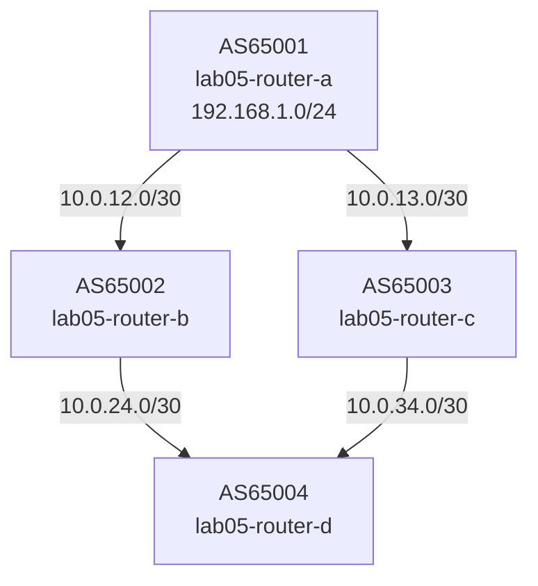

# Lab 05 — Many Paths

## Objectives

- See BGP best-path selection in action when multiple paths exist to the same prefix
- Understand how AS_PATH length influences best-path selection
- Use `show ip bgp` to read the path attributes on competing routes
- Observe what happens when you manipulate LOCAL_PREF and MED

## Concepts

BGP receives routes from multiple peers and must choose one **best path** to
install in the routing table. The **best-path selection algorithm** runs through
a sequence of attributes in order; the first attribute that differs picks the winner.

The most commonly exercised steps (in order):

1. **Highest LOCAL_PREF** — prefer the locally-preferred path (default: 100)
2. **Shortest AS_PATH** — fewer AS hops wins
3. **Lowest ORIGIN** — IGP < EGP < incomplete
4. **Lowest MED** — Multi-Exit Discriminator (hint from the peer about preferred entry)
5. **eBGP over iBGP** — external beats internal
6. **Lowest IGP metric to NEXT_HOP**
7. **Oldest route** (for stability), then lowest Router ID

In this lab, router-d receives 192.168.1.0/24 via two paths:
- Path via router-b: AS_PATH = `65002 65001`
- Path via router-c: AS_PATH = `65003 65001`

Both paths have the same AS_PATH length (2 hops), so BGP falls through to
lower tie-breakers (MED, then router-id). You'll manipulate these to force
a preference.

**MED** (Multi-Exit Discriminator) is a hint from a neighboring AS about which
entry point to use. Lower MED is preferred. It is only compared between paths
from the *same* AS, so router-b and router-c must be in the same AS for MED
to matter — in this lab they're in different ASes, so you'll use LOCAL_PREF
or AS_PATH prepending to force selection.

## Topology

```
           [AS65001 lab05-router-a] 192.168.1.0/24
           /10.0.12.0/30  \10.0.13.0/30
[AS65002 lab05-router-b]  [AS65003 lab05-router-c]
           \10.0.24.0/30  /10.0.34.0/30
           [AS65004 lab05-router-d]

router-a: eth0=10.0.12.1/30, eth1=10.0.13.1/30
router-b: eth0=10.0.12.2/30, eth1=10.0.24.1/30
router-c: eth0=10.0.13.2/30, eth1=10.0.34.1/30
router-d: eth0=10.0.24.2/30, eth1=10.0.34.2/30
```



router-a, router-b, router-c are pre-configured. router-d has TODO gaps.

## Setup

```bash
./setup.sh
```

Four containers start. router-d's sessions will be red (Idle) until configured.

## Exercises

**Exercise 1: Configure router-d**

Edit `configs/router-d.conf` — fill in the TODO sections:

```
neighbor 10.0.24.1 remote-as 65002
neighbor 10.0.34.1 remote-as 65003
...
 neighbor 10.0.24.1 activate
 neighbor 10.0.34.1 activate
```

Apply without restarting:

```bash
podman exec -it lab05-router-d vtysh << 'EOF'
configure terminal
router bgp 65004
 neighbor 10.0.24.1 remote-as 65002
 neighbor 10.0.34.1 remote-as 65003
 address-family ipv4 unicast
  neighbor 10.0.24.1 activate
  neighbor 10.0.34.1 activate
 exit-address-family
end
write memory
EOF
```

**Exercise 2: See both paths**

```bash
podman exec -it lab05-router-d vtysh -c "show ip bgp 192.168.1.0/24"
```

You'll see two entries. The `>` marker indicates the best path. Note the
AS_PATH and NEXT_HOP for each.

**Exercise 3: Identify what picked the winner**

When AS_PATH lengths are equal, BGP falls to MED (but only compares paths
from the same neighboring AS), then to router-id. Router-a has router-id
`10.0.12.1` (lowest); router-b has `10.0.12.2`; router-c has `10.0.13.2`.

The path via router-b (NEXT_HOP=10.0.24.1) wins because router-b's router-id
(`10.0.12.2`) is lower than router-c's (`10.0.13.2`).

**Exercise 4: Force traffic via router-c using AS_PATH prepending**

On router-b, prepend its own ASN once to make its path appear longer:

```bash
podman exec -it lab05-router-b vtysh << 'EOF'
configure terminal
route-map PREPEND-OUT permit 10
 set as-path prepend 65002
!
router bgp 65002
 address-family ipv4 unicast
  neighbor 10.0.24.2 route-map PREPEND-OUT out
 exit-address-family
end
write memory
EOF
```

Wait for route refresh, then check router-d again:

```bash
podman exec -it lab05-router-d vtysh -c "show ip bgp 192.168.1.0/24"
# Expected: path via router-c (AS_PATH 65003 65001) is now best
```

**Exercise 5 (challenge): Use LOCAL_PREF to prefer router-b again**

Set LOCAL_PREF=200 on router-d for routes received from router-b:

```bash
podman exec -it lab05-router-d vtysh << 'EOF'
configure terminal
route-map SET-LOCALPREF permit 10
 set local-preference 200
!
router bgp 65004
 address-family ipv4 unicast
  neighbor 10.0.24.1 route-map SET-LOCALPREF in
 exit-address-family
end
write memory
EOF
```

LOCAL_PREF is checked before AS_PATH, so even the prepended path from router-b
should win again.

## Verification

```bash
# All sessions established
podman exec -it lab05-router-d vtysh -c "show bgp summary"
# Expected: two neighbors, both Established, PfxRcd=1 each

# Both paths visible
podman exec -it lab05-router-d vtysh -c "show ip bgp 192.168.1.0/24"
# Expected: two lines, one marked > (best), different NEXT_HOP

# Best path installed in routing table
podman exec -it lab05-router-d vtysh -c "show ip route 192.168.1.0/24"
# Expected: one entry via the best-path's NEXT_HOP
```

## Troubleshooting

**Only one path visible on router-d:**
Both sessions must be Established. Check `show bgp summary` — if one peer is
still Active, the session isn't up. Verify the neighbor IP/ASN config on both
sides matches.

**Route-map not taking effect:**
After applying a route-map with `out` direction, trigger a route refresh:
```bash
podman exec -it lab05-router-d vtysh -c "clear bgp * soft in"
```
After `in` direction route-maps, the remote peer must resend routes — use soft-clear.

**Enable BGP debug logging:**
```bash
podman exec -it lab05-router-d vtysh -c "debug bgp best-path" && podman logs -f lab05-router-d
```

**topology-watch or packet-watch port already in use:**
```bash
pkill -f topology_watch; pkill -f packet_watch
./setup.sh
```
