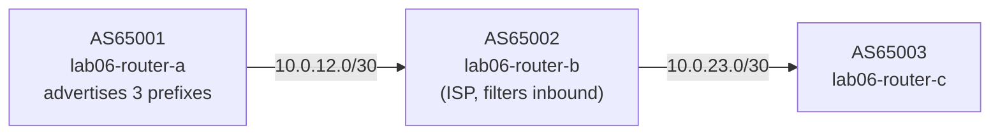

# Lab 06 — Route Filtering

## Objectives

- Apply a prefix-list to filter which prefixes an ISP accepts from a customer
- See the difference between routes in the BGP table vs. the routing table after filtering
- Understand the default-deny behavior at the end of a prefix-list
- Trigger a soft route refresh after applying a filter

## Concepts

**Prefix-lists** are the primary tool for filtering which prefixes BGP accepts or
advertises. A prefix-list is an ordered sequence of `permit` or `deny` statements,
each matching a prefix with an optional length range.

Evaluation:
1. BGP compares each received prefix against the list in order (by sequence number)
2. The first matching entry wins — either permit or deny
3. If nothing matches, the **implicit deny** at the end drops the route

**Why filter at all?** An ISP must not accept:
- RFC 1918 / bogon prefixes (10.0.0.0/8, 192.168.0.0/16, etc.)
- Overly broad prefixes (advertising 0.0.0.0/0 would hijack all traffic)
- Prefixes the customer doesn't legitimately own

In this lab, router-a (customer) advertises three prefixes. router-b (ISP) should
only accept the two customer-owned /24s — and drop the bogon 10.0.0.0/8.

**Soft reconfiguration / route refresh:** After changing a filter, FRR does not
automatically re-evaluate already-received routes. You must trigger a soft inbound
reconfiguration:
```bash
vtysh -c "clear bgp * soft in"
```
This asks the peer to resend its UPDATE messages without dropping the session.

## Topology

```
[AS65001 lab06-router-a]──10.0.12.0/30──[AS65002 lab06-router-b]──10.0.23.0/30──[AS65003 lab06-router-c]
 advertises:                              (ISP, filters inbound)                   (downstream peer)
  192.168.1.0/24
  192.168.2.0/24
  10.0.0.0/8  ← should be filtered

router-a: eth0=10.0.12.1/30
router-b: eth0=10.0.12.2/30, eth1=10.0.23.1/30
router-c: eth0=10.0.23.2/30
```



router-a and router-c are pre-configured. router-b has TODO gaps for you to fill in.

## Setup

```bash
./setup.sh
```

Three containers start. All three sessions come up immediately. Initially
router-b accepts all three prefixes from router-a — including the bogon.

## Exercises

**Exercise 1: See all prefixes without filtering**

```bash
# What router-b receives from router-a (unfiltered)
podman exec -it lab06-router-b vtysh -c "show ip bgp 10.0.12.1"
# Expected: three prefixes from router-a visible

podman exec -it lab06-router-b vtysh -c "show ip bgp"
# Expected: 192.168.1.0/24, 192.168.2.0/24, 10.0.0.0/8 all visible
```

Also check what router-c sees — the bogon gets propagated downstream:
```bash
podman exec -it lab06-router-c vtysh -c "show ip bgp"
# Expected: 10.0.0.0/8 visible on router-c (bad!)
```

**Exercise 2: Apply the prefix-list filter on router-b**

Edit `configs/router-b.conf` — fill in the TODO sections. The prefix-list
permits only the two customer /24s and denies everything else:

```
ip prefix-list CUSTOMER-IN seq 10 permit 192.168.1.0/24
ip prefix-list CUSTOMER-IN seq 20 permit 192.168.2.0/24
ip prefix-list CUSTOMER-IN seq 100 deny any
```

Then apply it to the inbound direction of router-a's session:
```
address-family ipv4 unicast
 neighbor 10.0.12.1 prefix-list CUSTOMER-IN in
```

Apply without restarting:

```bash
podman exec -i lab06-router-b vtysh << 'EOF'
configure terminal
ip prefix-list CUSTOMER-IN seq 10 permit 192.168.1.0/24
ip prefix-list CUSTOMER-IN seq 20 permit 192.168.2.0/24
ip prefix-list CUSTOMER-IN seq 100 deny any
router bgp 65002
 address-family ipv4 unicast
  neighbor 10.0.12.1 prefix-list CUSTOMER-IN in
 exit-address-family
end
write memory
EOF
```

**Exercise 3: Trigger a soft route refresh**

The filter is now configured, but router-b hasn't re-evaluated already-received
routes. Trigger a soft inbound reconfiguration:

```bash
podman exec -it lab06-router-b vtysh -c "clear bgp * soft in"
```

Wait 2-3 seconds for the route refresh.

**Exercise 4: Verify filtering**

```bash
# router-b's BGP table — bogon should be gone
podman exec -it lab06-router-b vtysh -c "show ip bgp"
# Expected: 192.168.1.0/24 and 192.168.2.0/24 only. No 10.0.0.0/8.

# router-c should no longer see the bogon
podman exec -it lab06-router-c vtysh -c "show ip bgp"
# Expected: only the two customer prefixes
```

**Exercise 5: Show the prefix-list**

```bash
podman exec -it lab06-router-b vtysh -c "show ip prefix-list CUSTOMER-IN"
# Shows each entry with a hit counter — seq 100 (deny any) should have count > 0
```

**Exercise 6 (challenge): Apply an outbound filter**

Prevent router-b from advertising 10.0.0.0/8 to router-c even if it was accepted:

```bash
podman exec -i lab06-router-b vtysh << 'EOF'
configure terminal
ip prefix-list BOGON-OUT seq 10 deny 10.0.0.0/8
ip prefix-list BOGON-OUT seq 100 permit any
router bgp 65002
 address-family ipv4 unicast
  neighbor 10.0.23.2 prefix-list BOGON-OUT out
 exit-address-family
end
write memory
EOF
# Trigger outbound refresh
podman exec -it lab06-router-c vtysh -c "clear bgp * soft in"
```

This provides defense-in-depth: both inbound and outbound filtering.

## Verification

```bash
# All sessions up
podman exec -it lab06-router-b vtysh -c "show bgp summary"
# Expected: 10.0.12.1 Established PfxRcd=2 (was 3 before filter), 10.0.23.2 Established

# Prefix-list applied inbound
podman exec -it lab06-router-b vtysh -c "show bgp neighbors 10.0.12.1"
# Look for: "Inbound soft reconfiguration allowed" or prefix-list line

# Bogon absent from router-c
podman exec -it lab06-router-c vtysh -c "show ip bgp"
# Expected: 2 prefixes, no 10.0.0.0/8
```

## Troubleshooting

**Filter applied but prefix still visible:**
You may not have triggered a soft reconfiguration after applying the filter:
```bash
podman exec -it lab06-router-b vtysh -c "clear bgp * soft in"
```

**Prefix-list not matching:**
Check the prefix exactly — a /24 prefix-list entry won't match a /8:
```bash
podman exec -it lab06-router-b vtysh -c "show ip prefix-list CUSTOMER-IN"
```

**All prefixes filtered (PfxRcd=0):**
If the implicit deny at the end of the list is too aggressive, add a `permit any`
with a higher sequence number:
```
ip prefix-list CUSTOMER-IN seq 100 deny any
```
This is intentional — an empty list with just `deny any` means "accept nothing."

**Enable BGP debug logging:**
```bash
podman exec -it lab06-router-b vtysh -c "debug bgp updates in" && podman logs -f lab06-router-b
```

**topology-watch or packet-watch port already in use:**
```bash
pkill -f topology_watch; pkill -f packet_watch
./setup.sh
```
