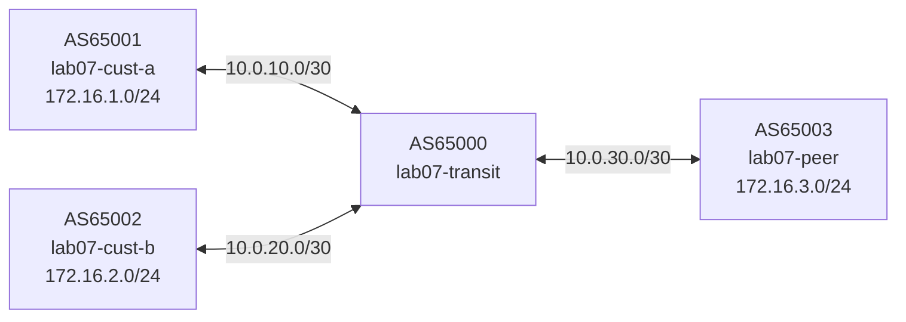

# Lab 07 — Communities

## Objectives

- Attach BGP community attributes to routes using route-maps
- Use community-lists to match routes by community in outbound filters
- Implement a common ISP policy: advertise customer routes to peers, but not peer routes to customers
- Read community values from `show ip bgp` output

## Concepts

**BGP communities** are 32-bit tags attached to route UPDATE messages, formatted
as `ASN:value` (e.g., `65000:100`). They are informational and carry no inherent
routing effect — their meaning is defined by local policy and inter-AS agreements.

Common uses:
- **Traffic classification**: tag routes as "customer" or "peer" for policy decisions
- **NO_EXPORT** (well-known): `no-export` tells neighbors not to re-advertise the route
- **Blackholing**: `65000:9999` might trigger null-routing at a provider
- **Signaling preferences**: a customer tags a route to request lower local-pref

In this lab, the transit router (AS65000) uses two communities:
- `65000:100` — customer route (from lab07-cust-a or lab07-cust-b)
- `65000:200` — peer route (from lab07-peer)

Policy goal:
- Customer routes get advertised to the peer (transit)
- Peer routes are NOT re-advertised to customers (no transit for free)

This is the fundamental "customer vs. peer" model used by every ISP.

## Topology

```
[AS65001 lab07-cust-a]──10.0.10.0/30──┐
                                        ├──[AS65000 lab07-transit]──10.0.30.0/30──[AS65003 lab07-peer]
[AS65002 lab07-cust-b]──10.0.20.0/30──┘

transit: eth0=10.0.10.1, eth1=10.0.20.1, eth2=10.0.30.1
cust-a:  eth0=10.0.10.2, advertises 172.16.1.0/24
cust-b:  eth0=10.0.20.2, advertises 172.16.2.0/24
peer:    eth0=10.0.30.2, advertises 172.16.3.0/24
```



lab07-transit has TODO gaps (route-maps, community-lists). All others pre-configured.

## Setup

```bash
./setup.sh
```

Four containers start. Initially, transit propagates all routes everywhere —
including peer routes to customers, which violates the business policy.

## Exercises

**Exercise 1: See the problem — peer routes leak to customers**

```bash
# What does cust-a see?
podman exec -it lab07-cust-a vtysh -c "show ip bgp"
# Expected (broken): 172.16.3.0/24 from peer visible! Customers shouldn't get peer routes.
```

**Exercise 2: Configure community tagging on transit**

Edit `configs/transit.conf` — fill in the route-maps and community-lists:

```
bgp community-list standard CUSTOMER permit 65000:100
bgp community-list standard PEER permit 65000:200

route-map CUST-IN permit 10
 set community 65000:100

route-map PEER-IN permit 10
 set community 65000:200

route-map CUST-ONLY-OUT permit 10
 match community CUSTOMER

route-map CUST-ONLY-OUT deny 100
```

Apply the route-maps to the sessions:
```
address-family ipv4 unicast
 neighbor 10.0.10.2 route-map CUST-IN in
 neighbor 10.0.10.2 route-map CUST-ONLY-OUT out
 neighbor 10.0.20.2 route-map CUST-IN in
 neighbor 10.0.20.2 route-map CUST-ONLY-OUT out
 neighbor 10.0.30.2 route-map PEER-IN in
 neighbor 10.0.30.2 route-map CUST-ONLY-OUT out
```

**Why CUST-ONLY-OUT on all three sessions?** The filter is applied on every outbound direction:
- To customers (10.0.10.2, 10.0.20.2): blocks peer routes from leaking downstream — this is the main goal
- To the peer (10.0.30.2): peer only receives customer routes (not its own routes reflected back)

Apply without restarting:

```bash
podman exec -i lab07-transit vtysh << 'EOF'
configure terminal
bgp community-list standard CUSTOMER permit 65000:100
bgp community-list standard PEER permit 65000:200
!
route-map CUST-IN permit 10
 set community 65000:100
!
route-map PEER-IN permit 10
 set community 65000:200
!
route-map CUST-ONLY-OUT permit 10
 match community CUSTOMER
!
route-map CUST-ONLY-OUT deny 100
!
router bgp 65000
 address-family ipv4 unicast
  neighbor 10.0.10.2 route-map CUST-IN in
  neighbor 10.0.10.2 route-map CUST-ONLY-OUT out
  neighbor 10.0.20.2 route-map CUST-IN in
  neighbor 10.0.20.2 route-map CUST-ONLY-OUT out
  neighbor 10.0.30.2 route-map PEER-IN in
  neighbor 10.0.30.2 route-map CUST-ONLY-OUT out
 exit-address-family
end
write memory
EOF
```

**Exercise 3: Trigger soft reconfiguration**

```bash
podman exec -it lab07-transit vtysh -c "clear bgp * soft"
sleep 3
```

**Exercise 4: Verify communities on transit**

```bash
podman exec -it lab07-transit vtysh -c "show ip bgp"
# Expected: 172.16.1.0/24 and 172.16.2.0/24 tagged with 65000:100
#           172.16.3.0/24 tagged with 65000:200
```

**Exercise 5: Verify peer no longer sees customer routes leaked back**

Actually peer SHOULD see customer routes — that's the transit business.
What should be prevented is customers seeing peer routes:

```bash
# Peer should see customer routes (this is the transit business)
podman exec -it lab07-peer vtysh -c "show ip bgp"
# Expected: 172.16.1.0/24 and 172.16.2.0/24 (customer routes)

# Customers should NOT see peer route
podman exec -it lab07-cust-a vtysh -c "show ip bgp"
# Expected: 172.16.2.0/24 (other customer) but NOT 172.16.3.0/24 (peer route)
```

**Exercise 6 (challenge): Add NO_EXPORT to all peer-received routes**

Attach the well-known `no-export` community to routes received from the peer,
preventing transit from re-advertising them to anyone:

```bash
podman exec -i lab07-transit vtysh << 'EOF'
configure terminal
route-map PEER-IN permit 10
 set community 65000:200 additive
 set community no-export additive
end
write memory
EOF
podman exec -it lab07-transit vtysh -c "clear bgp * soft in"
```

`no-export` is a standard community that all BGP implementations honor.

## Verification

```bash
# All sessions established
podman exec -it lab07-transit vtysh -c "show bgp summary"
# Expected: three neighbors, all Established

# Community tags visible
podman exec -it lab07-transit vtysh -c "show ip bgp 172.16.1.0/24"
# Expected: community 65000:100

podman exec -it lab07-transit vtysh -c "show ip bgp 172.16.3.0/24"
# Expected: community 65000:200

# Business policy enforced
podman exec -it lab07-cust-a vtysh -c "show ip bgp"
# Expected: 172.16.2.0/24 only (NOT 172.16.3.0/24)
```

## Troubleshooting

**Community not appearing on transit:**
Enable `send-community` on the neighbor session that sends the community. The
customer configs already have `neighbor ... send-community`.

**Route-map not filtering:**
Confirm the route-map `CUST-ONLY-OUT deny 100` entry exists. Without an explicit
deny at the end, FRR defaults to permit — the filter won't work.

After applying changes, always run `clear bgp * soft`.

**Enable BGP debug logging:**
```bash
podman exec -it lab07-transit vtysh -c "debug bgp updates" && podman logs -f lab07-transit
```

**topology-watch or packet-watch port already in use:**
```bash
pkill -f topology_watch; pkill -f packet_watch
./setup.sh
```
