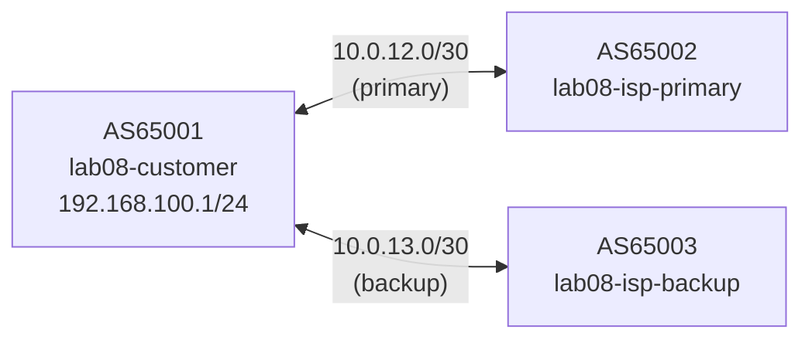

# Lab 08 — Failover

## Objectives

- Configure a dual-homed customer router with primary and backup ISP connections
- Use LOCAL_PREF to prefer one ISP over the other for inbound default route selection
- Simulate primary ISP failure and observe automatic failover to the backup
- Understand BGP hold-timer and keepalive-timer in the context of failover speed

## Concepts

**Dual-homing** is the practice of connecting to two different ISPs for redundancy.
When the primary ISP fails, BGP should automatically withdraw its routes, causing
the customer to fall back to the backup ISP.

**LOCAL_PREF** is a BGP attribute set by the local router (not advertised to eBGP
peers). Higher LOCAL_PREF wins in best-path selection (default: 100). By setting
LOCAL_PREF=200 on routes from the primary ISP and LOCAL_PREF=100 on routes from
the backup, the primary path is always preferred when both are up.

```
Normal operation:
  Customer installs 0.0.0.0/0 via primary ISP (LOCAL_PREF=200, preferred)

Failover scenario:
  Primary ISP session drops (hold timer expires or TCP resets)
  BGP withdraws primary's default route
  Customer installs 0.0.0.0/0 via backup ISP (LOCAL_PREF=100)
  Failover complete — traffic now exits via backup
```

**Failover timing** depends on the BGP hold timer (default: 90s) and keepalive
interval (default: 30s). If you want faster failover, configure shorter timers:
```
neighbor X timers 3 9   # keepalive=3s, hold=9s
```
BFD (Bidirectional Forwarding Detection) can detect failures in sub-second time.

## Topology

```
[lab08-customer AS65001]──10.0.12.0/30──[lab08-isp-primary AS65002]
         │
         └─10.0.13.0/30──[lab08-isp-backup AS65003]

customer: eth0=10.0.12.1 (primary), eth1=10.0.13.1 (backup)
isp-primary: eth0=10.0.12.2, advertises 0.0.0.0/0
isp-backup:  eth0=10.0.13.2, advertises 0.0.0.0/0
```



All three routers are pre-configured. The failover policy (LOCAL_PREF) is
already set in customer.conf — this lab focuses on observing and testing it.

## Setup

```bash
./setup.sh
```

Three containers start. Both ISP sessions come up and the customer receives
default routes from both.

## Exercises

**Exercise 1: Confirm primary is preferred**

```bash
# See both default routes in the BGP table
podman exec -it lab08-customer vtysh -c "show ip bgp 0.0.0.0/0"
# Expected: two entries — one from 10.0.12.2 (LOCAL_PREF=200, best >) and
#           one from 10.0.13.2 (LOCAL_PREF=100)

# Check which is installed in the routing table
podman exec -it lab08-customer vtysh -c "show ip route 0.0.0.0/0"
# Expected: via 10.0.12.2 (primary ISP)
```

**Exercise 2: Inspect LOCAL_PREF values**

```bash
podman exec -it lab08-customer vtysh -c "show ip bgp 0.0.0.0/0"
# Look for the "localpref" field on each entry
# Primary:  locprf 200
# Backup:   locprf 100
```

**Exercise 3: Simulate primary ISP failure**

Kill the primary ISP container to simulate link loss:

```bash
podman stop lab08-isp-primary
```

All three routers are pre-configured with short timers (`timers 3 9`): keepalive=3s, hold=9s.
Failover happens within ~10 seconds of the primary going down:

```bash
# Watch logs for "NOTIFICATION received" or "bgp_read_packet error"
podman logs -f lab08-customer
```

After the hold timer expires, check that the backup took over:

```bash
podman exec -it lab08-customer vtysh -c "show ip route 0.0.0.0/0"
# Expected: now via 10.0.13.2 (backup ISP)

podman exec -it lab08-customer vtysh -c "show bgp summary"
# Expected: 10.0.12.2 shows idle/active, 10.0.13.2 shows Established
```

**Exercise 4: Restore primary and verify it takes back over**

```bash
podman start lab08-isp-primary
sleep 30  # wait for BGP to re-establish and reconverge
podman exec -it lab08-customer vtysh -c "show ip route 0.0.0.0/0"
# Expected: back to 10.0.12.2 (primary) — LOCAL_PREF=200 preferred again
```

**Exercise 5 (challenge): Speed up failover with BFD**

BGP can use BFD to detect failures in sub-second time:

```bash
podman exec -i lab08-customer vtysh << 'EOF'
configure terminal
router bgp 65001
 neighbor 10.0.12.2 bfd
 neighbor 10.0.13.2 bfd
end
write memory
EOF

podman exec -i lab08-isp-primary vtysh << 'EOF'
configure terminal
router bgp 65002
 neighbor 10.0.12.1 bfd
end
write memory
EOF
```

Check BFD session status:
```bash
podman exec -it lab08-customer vtysh -c "show bfd peers"
```

Now repeat Exercise 3 — the failover should happen in 1-3 seconds instead of 90.

**Exercise 6 (challenge): Configure fast keepalive timers instead of BFD**

Set 3s keepalive / 9s hold on both sides of the primary link:

```bash
podman exec -i lab08-customer vtysh << 'EOF'
configure terminal
router bgp 65001
 neighbor 10.0.12.2 timers 3 9
end
write memory
EOF

podman exec -i lab08-isp-primary vtysh << 'EOF'
configure terminal
router bgp 65002
 neighbor 10.0.12.1 timers 3 9
end
write memory
EOF
```

After stopping lab08-isp-primary, failover should happen within ~9 seconds.

## Verification

```bash
# Both sessions up
podman exec -it lab08-customer vtysh -c "show bgp summary"
# Expected: 10.0.12.2 Established, 10.0.13.2 Established

# Primary path preferred
podman exec -it lab08-customer vtysh -c "show ip bgp 0.0.0.0/0"
# Expected: > on the 10.0.12.2 entry (locprf 200)

# After failure: backup active
# Stop primary, wait ~90s (or 9s with fast timers), then:
podman exec -it lab08-customer vtysh -c "show ip route 0.0.0.0/0"
# Expected: via 10.0.13.2
```

## Troubleshooting

**`write memory` warns "Error renaming frr.conf.sav: Device or resource busy":**
Harmless. FRR cannot rename the bind-mounted config file before rewriting it, but the config is written and routes are installed correctly. The `[OK]` line confirms success.

**Both routes show LOCAL_PREF=100:**
Check that the PRIMARY-IN route-map is applied inbound on `neighbor 10.0.12.2`.
Run `show running-config` and verify the route-map line is present.

**After stopping primary, customer still routes via primary:**
BGP has not yet detected the failure — the hold timer hasn't expired.
Default hold timer is 90s. Watch `podman logs -f lab08-customer` for the
notification. Or configure shorter timers (Exercise 6).

**Primary session doesn't come back up after `podman start`:**
Wait 30s for the hold timer on the customer side. Or clear it manually:
```bash
podman exec -it lab08-customer vtysh -c "clear bgp 10.0.12.2"
```

**Enable BGP debug logging:**
```bash
podman exec -it lab08-customer vtysh -c "debug bgp neighbor-events" && podman logs -f lab08-customer
```

**topology-watch or packet-watch port already in use:**
```bash
pkill -f topology_watch; pkill -f packet_watch
./setup.sh
```
