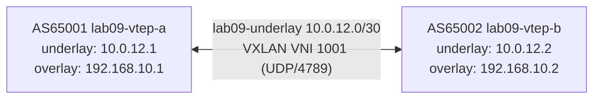

# Lab 09 — Underlay vs Overlay

## Objectives

- Understand the difference between an underlay (routed IP network) and an overlay (logical network tunneled on top)
- Build a VXLAN tunnel between two VTEPs on a BGP-routed underlay
- Observe the same traffic twice: once as raw UDP/4789 (underlay) and once decoded as inner Ethernet/IP (overlay)
- Demonstrate that VXLAN encapsulation provides no confidentiality — a sniffer with VXLAN decode sees the inner frames completely

## Concepts

**Underlay** is the routed IP network that carries all traffic. In this lab, the underlay is a /30 link between two VTEP routers with BGP establishing reachability between them.

**Overlay** is a logical L2 network built on top of the underlay using encapsulation. In this lab, VXLAN (Virtual Extensible LAN) creates one logical segment (VNI 1001) that stretches across the underlay.

**VXLAN** (RFC 7348) encapsulates an inner Ethernet frame inside a UDP packet on port 4789. Each encapsulated segment gets a 24-bit VNI (VXLAN Network Identifier). The outer IP header uses underlay addresses; the inner frame uses overlay addresses.

> **Real-world note:** If you work with OpenShift or Kubernetes, you'll encounter
> **Geneve** (UDP port 6081) rather than VXLAN — it is the default overlay for
> OVN-Kubernetes. Geneve uses the same VNI-based segmentation model and the same BGP
> EVPN control plane; the difference is an extensible options header that lets the
> control plane attach metadata to frames. The concepts you learn here transfer
> directly. See [Network Layers](../docs/04-reference/network-layers.md) for a
> side-by-side comparison.

**VTEP** (VXLAN Tunnel Endpoint) is a device that encapsulates and decapsulates VXLAN frames. In this lab, each FRR router also acts as a VTEP — it has a `vxlan0` interface that handles encapsulation automatically.

When vtep-a pings 192.168.10.2, the kernel encapsulates the ICMP packet in VXLAN:
outer IP from 10.0.12.1 to 10.0.12.2 → UDP port 4789 → VNI 1001 → inner IP from 192.168.10.1 to 192.168.10.2.

## Topology



Both VTEPs are fully pre-configured. This lab focuses on observation.

## Setup

```bash
./setup.sh
```

Two containers start. BGP establishes on the underlay, then VXLAN interfaces are created automatically. topology-watch opens at `http://localhost:8309` — the dashed tunnel edge turns green when the VXLAN interfaces are UP. packet-watch starts in dual-pane mode.

## Exercises

**Exercise 1: Confirm the underlay (BGP) is up**

```bash
podman exec -it lab09-vtep-a vtysh -c "show bgp summary"
# Expected: 10.0.12.2 — Established, 1 prefix received (vtep-b's loopback)

podman exec -it lab09-vtep-a vtysh -c "show ip bgp"
# Expected: 10.10.10.2/32 from 10.0.12.2 in BGP table
```

**Exercise 2: Confirm the VXLAN interface is up**

```bash
podman exec -it lab09-vtep-a ip link show vxlan0
# Expected: vxlan0: <BROADCAST,MULTICAST,UP,LOWER_UP> state UP

podman exec -it lab09-vtep-a ip addr show vxlan0
# Expected: inet 192.168.10.1/24 scope global vxlan0

podman exec -it lab09-vtep-a bridge fdb show dev vxlan0
# Expected: 00:00:00:00:00:00 dst 10.0.12.2 self permanent  (default VTEP entry)
```

**Exercise 3: Send traffic through the tunnel**

```bash
podman exec -it lab09-vtep-a ping -c 5 192.168.10.2
```

Expected: 5 packets sent, 5 received. While pinging, watch packet-watch:

```
── UNDERLAY ─────────────────────────────────────────────────────────────────
HH:MM:SS  lab09-underlay  10.0.12.1 → 10.0.12.2  VNI:1001  inner:[...]→[...]
HH:MM:SS  lab09-underlay  10.0.12.2 → 10.0.12.1  VNI:1001  inner:[...]→[...]

── OVERLAY ──────────────────────────────────────────────────────────────────
HH:MM:SS  lab09-underlay  192.168.10.1 → 192.168.10.2  ICMP  VNI:1001
HH:MM:SS  lab09-underlay  192.168.10.2 → 192.168.10.1  ICMP  VNI:1001
```

The same physical packet appears in both panes from different vantage points.

**Exercise 4: Security exercise — decode the inner frame yourself**

Attach a debug container to the underlay network and decode VXLAN inline:

```bash
podman run --rm -it \
  --network lab09-underlay \
  ghcr.io/container-images/debugging-tools bash
```

Inside the debug container, while vtep-a pings vtep-b:

```bash
tshark -i eth0 -d udp.port==4789,vxlan -Y vxlan 2>/dev/null
```

Expected output (abbreviated):
```
  1 0.000  10.0.12.1 → 10.0.12.2  VXLAN  VXLAN, Flags: [I], VNI: 1001
      Inner frame: 192.168.10.1 → 192.168.10.2  ICMP Echo request
  2 0.001  10.0.12.2 → 10.0.12.1  VXLAN  VXLAN, Flags: [I], VNI: 1001
      Inner frame: 192.168.10.2 → 192.168.10.1  ICMP Echo reply
```

**The lesson:** An observer on the underlay network can read the inner packet's source IP, destination IP, and protocol without any special access. VXLAN encapsulation is transparent to a sniffer — it is not encryption.

**Exercise 5 (discussion): What would IPsec change?**

If the underlay links were protected by IPsec or WireGuard:
- The observer's `tshark` would see encrypted ESP/UDP packets, not VXLAN
- The inner frames would be unreadable without the encryption keys
- VXLAN could still run inside the encrypted tunnel, but the sniffer cannot decode it

VXLAN handles multi-tenancy segmentation. IPsec/WireGuard handles confidentiality. They solve different problems.

## Verification

```bash
# BGP underlay established
podman exec -it lab09-vtep-a vtysh -c "show bgp summary"
# Expected: Established, 1 prefix

# VXLAN tunnel up
podman exec -it lab09-vtep-a ip link show vxlan0
# Expected: state UP

# Overlay connectivity
podman exec -it lab09-vtep-a ping -c 3 192.168.10.2
# Expected: 0% packet loss

# FDB populated after first ping (vtep-b's MAC learned)
podman exec -it lab09-vtep-a bridge fdb show dev vxlan0
# Expected: <vtep-b's MAC> dst 10.0.12.2 self  (learned entry alongside the permanent default)
```

## Troubleshooting

**`ip link add vxlan0 type vxlan` fails with "RTNETLINK answers: No such device":**
The `vxlan` kernel module is not loaded in the Podman VM. Run:
```bash
# On the Podman machine (macOS: podman machine ssh; Linux: on the host):
sudo modprobe vxlan
```
Then re-run `./setup.sh`.

**Ping to 192.168.10.2 fails after VXLAN is up:**
```bash
# Check underlay connectivity first
podman exec -it lab09-vtep-a ping -c 3 10.0.12.2
# If this fails: BGP isn't routing the underlay — check show bgp summary

# Check vxlan0 is UP on both VTEPs
podman exec -it lab09-vtep-a ip link show vxlan0
podman exec -it lab09-vtep-b ip link show vxlan0

# Check remote VTEP address in FDB
podman exec -it lab09-vtep-a bridge fdb show dev vxlan0
# Must show: 00:00:00:00:00:00 dst 10.0.12.2 self permanent
```

**packet-watch shows only one pane (not dual-pane):**
Check that `lab09-underlay` in lab.json has `"vni": 1001` (non-null). If vni is null, packet-watch runs in standard BGP-only mode.

**Debug container pattern:**
```bash
# Join vtep-a's namespace
podman run --rm -it --network container:lab09-vtep-a ghcr.io/container-images/debugging-tools bash
ip addr show vxlan0
ping 192.168.10.2

# Observe underlay traffic
podman run --rm -it --network lab09-underlay ghcr.io/container-images/debugging-tools bash
tcpdump -i eth0 udp port 4789
```

**topology-watch or packet-watch port already in use:**
```bash
pkill -f topology_watch; pkill -f packet_watch
./setup.sh
```
