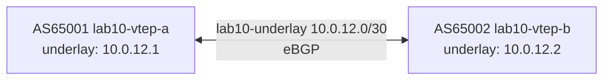
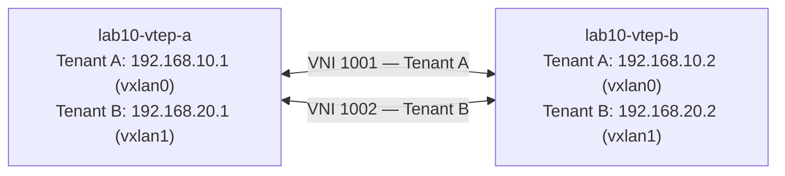

# Lab 10 — Microsegmentation

## Objectives

- Use VNIs to create L2 isolation between tenant groups on a shared underlay
- Demonstrate why L2 isolation alone is insufficient: a shared routing table allows cross-tenant routing
- Use Linux VRFs to create separate L3 routing tables per tenant, achieving full microsegmentation
- Understand inter-VRF route leaking as a controlled, policy-driven exception to isolation
- Read `ip route show vrf <name>` to confirm routing table separation

## Concepts

**Microsegmentation** means isolating traffic at both L2 and L3 so that one tenant cannot reach another's resources, even if they share the same physical infrastructure.

**VNI (VXLAN Network Identifier)** creates L2 isolation: packets in VNI 1001 never appear in VNI 1002's broadcast domain. Hosts on different VNIs can't ARP each other — they're on different virtual L2 segments.

**VRF (Virtual Routing and Forwarding)** creates L3 isolation: each VRF has its own routing table. A route in `Tenant-A`'s table is invisible to `Tenant-B`'s table, even on the same physical device.

**The gap VNIs leave open:** VNIs isolate broadcast domains (L2). But if the VTEP's main routing table contains routes for both tenants, an attacker with routing access to the VTEP can potentially reach both tenant subnets. VRFs close this gap by making the L3 routing tables completely separate.

```
UNDERLAY:  [vtep-a]──10.0.12.0/30──[vtep-b]

VNI 1001 (Tenant A — 192.168.10.0/24):
  vtep-a: 192.168.10.1 (vxlan0)  <->  vtep-b: 192.168.10.2 (vxlan0)

VNI 1002 (Tenant B — 192.168.20.0/24):
  vtep-a: 192.168.20.1 (vxlan1)  <->  vtep-b: 192.168.20.2 (vxlan1)
```

## Topology

**Underlay — BGP-routed /30 link**



**Overlay — two isolated VXLAN segments**



Both VTEPs are pre-configured with BGP underlay and both VXLAN interfaces. VRF exercises are done live in Parts 2 and 3.

## Setup

```bash
./setup.sh
```

Two containers start. BGP establishes on the underlay. VXLAN interfaces `vxlan0` (VNI 1001) and `vxlan1` (VNI 1002) are created on both VTEPs. packet-watch runs in dual-pane mode and shows traffic from both VNIs.

## Exercises

### Part 1 — L2 isolation via VNIs

**Exercise 1: Confirm Tenant A can reach itself across the tunnel**

```bash
podman exec -it lab10-vtep-a ping -c 3 192.168.10.2
# Expected: 0% loss — VNI 1001 tunnel is working
```

**Exercise 2: Confirm Tenant B can reach itself across the tunnel**

```bash
podman exec -it lab10-vtep-a ping -c 3 192.168.20.2
# Expected: 0% loss — VNI 1002 tunnel is working
```

Watch packet-watch — you'll see both VNIs in the overlay pane:
```
── OVERLAY ──────────────────────────────────────────────────
... 192.168.10.1 → 192.168.10.2  ICMP  VNI:1001
... 192.168.20.1 → 192.168.20.2  ICMP  VNI:1002
```

**Exercise 3: Try cross-VNI ping (should fail)**

```bash
podman exec -it lab10-vtep-a ping -c 3 -I vxlan0 192.168.20.2
# Expected: PING fails — "Network unreachable" or 100% loss
```

Check the routing table:
```bash
podman exec -it lab10-vtep-a ip route show
# Expected: BOTH 192.168.10.0/24 (vxlan0) AND 192.168.20.0/24 (vxlan1) are present
```

The ping from vxlan0 to 192.168.20.x fails because vtep-a routes 192.168.20.0/24 out vxlan1 (not vxlan0). VNI 1001's VTEP at 10.0.12.2 does not bridge into VNI 1002. VNI isolation is working at L2.

### Part 2 — The routing table leak problem

**Exercise 4: Observe the shared routing table**

```bash
podman exec -it lab10-vtep-a ip route show
```

Expected:
```
192.168.10.0/24 dev vxlan0 proto kernel scope link src 192.168.10.1
192.168.20.0/24 dev vxlan1 proto kernel scope link src 192.168.20.1
10.0.12.0/30    dev eth0   proto kernel scope link src 10.0.12.1
```

**Both tenant subnets live in the same routing table.** A host with routing access to vtep-a can reach both tenant subnets by just sending IP packets to vtep-a — the main routing table will forward them to the correct VXLAN interface. VNI isolation stopped L2 broadcast leakage, but the L3 routing table is shared.

**Exercise 5: Confirm vtep-a routes to both tenants**

```bash
podman exec -it lab10-vtep-a ping -c 3 192.168.10.2
# Expected: success (Tenant A)
podman exec -it lab10-vtep-a ping -c 3 192.168.20.2
# Expected: success (Tenant B)
```

From vtep-a's perspective, both tenant subnets are reachable. This is the L3 isolation gap.

### Part 3 — L3 isolation via VRFs

**Exercise 6: Create VRFs for each tenant on vtep-a**

```bash
podman exec -it lab10-vtep-a bash << 'EOF'
# Create VRF devices with separate routing tables
ip link add Tenant-A type vrf table 100
ip link set Tenant-A up
ip link add Tenant-B type vrf table 101
ip link set Tenant-B up

# Assign each VXLAN interface to its VRF
ip link set vxlan0 master Tenant-A
ip link set vxlan1 master Tenant-B

# Re-add IP addresses — enslaving to VRF removes them in Linux
ip addr add 192.168.10.1/24 dev vxlan0
ip addr add 192.168.20.1/24 dev vxlan1
EOF
```

**Exercise 7: Verify separate routing tables**

```bash
podman exec -it lab10-vtep-a ip route show vrf Tenant-A
# Expected: only 192.168.10.0/24 dev vxlan0 — Tenant B routes NOT visible

podman exec -it lab10-vtep-a ip route show vrf Tenant-B
# Expected: only 192.168.20.0/24 dev vxlan1 — Tenant A routes NOT visible

podman exec -it lab10-vtep-a ip route show
# Expected: main table — neither 192.168.10.0/24 nor 192.168.20.0/24
#           (both are now in their VRFs' tables)
```

**Exercise 8: Confirm cross-VNI is now blocked at L3**

```bash
# Execute in Tenant-A's VRF context
podman exec -it lab10-vtep-a ip vrf exec Tenant-A ping -c 3 192.168.20.2
# Expected: PING fails — "Network is unreachable"
# Reason: Tenant-A's routing table has no route to 192.168.20.0/24

podman exec -it lab10-vtep-a ip vrf exec Tenant-B ping -c 3 192.168.10.2
# Expected: PING fails — same reason in the other direction
```

VRFs provide L3 microsegmentation — no cross-tenant routing is possible without an explicit policy exception.

**Exercise 9: Explicit inter-VRF route leak (controlled access)**

To allow a specific prefix from Tenant A to reach Tenant B — for example, a shared service — you create an explicit route across VRFs via a veth pair:

```bash
podman exec -it lab10-vtep-a bash << 'EOF'
# Create a veth pair to bridge between VRFs
ip link add veth-ab type veth peer name veth-ba
ip link set veth-ab master Tenant-A
ip link set veth-ba master Tenant-B
ip link set veth-ab up
ip link set veth-ba up
ip addr add 172.16.0.1/30 dev veth-ab
ip addr add 172.16.0.2/30 dev veth-ba

# Leak Tenant-B's 192.168.20.0/24 into Tenant-A's routing table
ip route add vrf Tenant-A 192.168.20.0/24 via 172.16.0.2 dev veth-ab
ip route add vrf Tenant-B 172.16.0.1/30 dev veth-ba
EOF
```

```bash
podman exec -it lab10-vtep-a ip vrf exec Tenant-A ping -c 3 192.168.20.1
# Expected: Success — Tenant A can reach vtep-a's own Tenant B address (192.168.20.1) via the leak
# Note: pinging vtep-b's 192.168.20.2 would fail because vtep-b has no return route to 172.16.0.0/30
```

The leak is **policy-driven and explicit** — it requires adding a specific route. No other traffic crosses tenants.

**Exercise 10: Remove the leak and restore full isolation**

```bash
podman exec -it lab10-vtep-a ip route del vrf Tenant-A 192.168.20.0/24
podman exec -it lab10-vtep-a ip vrf exec Tenant-A ping -c 3 192.168.20.1
# Expected: fails — "Network is unreachable" — isolation restored without restarting anything
```

## Verification

```bash
# Both VNIs up on vtep-a
podman exec -it lab10-vtep-a ip -br link show type vxlan
# Expected: vxlan0  UP  ...
#           vxlan1  UP  ...

# Tenant A within-VNI connectivity (before VRF setup)
podman exec -it lab10-vtep-a ping -c 3 192.168.10.2
# Expected: 0% loss

# After VRF setup: within-VNI connectivity via VRF context
podman exec -it lab10-vtep-a ip vrf exec Tenant-A ping -c 3 192.168.10.2
# Expected: 0% loss

# Tenant A cannot reach Tenant B (after VRF setup)
podman exec -it lab10-vtep-a ip vrf exec Tenant-A ping -c 3 192.168.20.2
# Expected: Network unreachable

# Routing table separation confirmed
podman exec -it lab10-vtep-a ip route show vrf Tenant-A
# Expected: only 192.168.10.0/24 present
```

## Troubleshooting

**setup.sh fails at "Configuring VXLAN tunnels" with "RTNETLINK answers: No such device":**
The `vxlan` kernel module is not loaded. Run:
```bash
# macOS (inside the Podman machine):
podman machine ssh -- sudo modprobe vxlan

# Linux:
sudo modprobe vxlan
```
Then re-run `./setup.sh`.

**After `ip link set vxlan0 master Tenant-A`, within-VNI ping fails:**
The IP address was removed when the interface was enslaved to the VRF. Re-add it:
```bash
podman exec -it lab10-vtep-a ip addr add 192.168.10.1/24 dev vxlan0
podman exec -it lab10-vtep-a ip addr add 192.168.20.1/24 dev vxlan1
```

**`ip route show vrf Tenant-A` shows "Error: argument ... is wrong: invalid vrf name":**
The VRF device was not created or the name doesn't match. Check:
```bash
podman exec -it lab10-vtep-a ip -br link show type vrf
# Should list: Tenant-A and Tenant-B
```
If `ip route show vrf` is unavailable (older iproute2), use the table ID directly:
```bash
podman exec -it lab10-vtep-a ip route show table 100   # Tenant-A
podman exec -it lab10-vtep-a ip route show table 101   # Tenant-B
```

**Cross-VNI ping still works after VRF setup:**
The ping may be sourced from vtep-a's main namespace (not inside the VRF). Use `ip vrf exec Tenant-A ping ...` to execute the ping inside the correct VRF context.

**vxlan1 interface not found:**
Only VNI 1001 (vxlan0) is up. Check setup.sh ran to completion — `vxlan1` setup is later in the script. Re-run `./setup.sh` to recreate both.

**packet-watch shows only VNI 1001 traffic:**
VNI 1002 traffic only appears when pinging across vxlan1. Trigger it:
```bash
podman exec -it lab10-vtep-a ping -c 3 192.168.20.2
```

**Debug container pattern:**
```bash
# Inspect both VXLAN interfaces on vtep-a
podman exec -it lab10-vtep-a ip -br addr show type vxlan

# See all routing tables (main + VRFs after Exercise 6)
podman exec -it lab10-vtep-a ip route show table all

# Attach to underlay to see both VNIs as raw VXLAN packets
podman run --rm -it --network lab10-underlay ghcr.io/container-images/debugging-tools bash
tcpdump -i eth0 udp port 4789 -n
```

**topology-watch or packet-watch port already in use:**
```bash
pkill -f topology_watch; pkill -f packet_watch
./setup.sh
```
