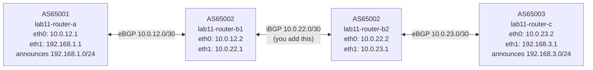

# Lab 11: iBGP Full Mesh

## Objectives

- Understand why iBGP (internal BGP) is required inside an autonomous system
- Observe the iBGP split-horizon rule: a route learned from one iBGP peer is never re-advertised to another
- Diagnose unreachable next-hops caused by missing `next-hop-self`
- Configure a working iBGP full mesh with `next-hop-self` on border routers

## Concepts

**iBGP vs eBGP:** eBGP connects routers in different autonomous systems. iBGP connects routers *within* the same AS to share externally-learned routes. Unlike eBGP, iBGP does not increment the AS_PATH and — critically — does not rewrite the NEXT_HOP attribute.

**Split-horizon rule:** To prevent routing loops, a BGP router will not re-advertise a route learned from an iBGP peer to another iBGP peer. This means every iBGP router must peer directly with every other iBGP router (full mesh) unless a route reflector is used (see Lab 12).

**next-hop-self:** When router-b1 learns `192.168.1.0/24` from router-a via eBGP, the NEXT_HOP is `10.0.12.1` (router-a). When b1 advertises this to b2 over iBGP, b2 receives the same next-hop: `10.0.12.1`. But b2 has no route to `10.0.12.1` — it's on b1's external interface. The fix is `next-hop-self`: b1 rewrites the next-hop to its own b1-b2 link address (`10.0.22.1`) so b2 can actually reach it.

## Topology



- **router-a** (AS65001): announces `192.168.1.0/24` via eBGP to router-b1
- **router-b1** (AS65002): eBGP peer with router-a; b1-b2 link wired but no BGP session yet
- **router-b2** (AS65002): eBGP peer with router-c; same AS as b1, no knowledge of AS65001 routes
- **router-c** (AS65003): announces `192.168.3.0/24` via eBGP to router-b2

## Setup

```bash
bash setup.sh
```

The eBGP sessions (router-a ↔ router-b1 and router-b2 ↔ router-c) come up automatically. The iBGP session between b1 and b2 does **not** exist — you will build it.

## Exercises

### Exercise 1 — Observe the broken state

With only eBGP configured, verify that end-to-end reachability fails:

```bash
# router-b1 learns 192.168.1.0/24 from AS65001
podman exec lab11-router-b1 vtysh -c "show bgp ipv4 unicast"

# router-b2 has no knowledge of 192.168.1.0/24
podman exec lab11-router-b2 vtysh -c "show bgp ipv4 unicast"

# End-to-end ping fails (router-c can't reach AS65001)
podman exec lab11-router-c ping -c 3 192.168.1.1
```

### Exercise 2 — Add iBGP without next-hop-self

Add an iBGP session between b1 and b2 using their b1-b2 link addresses:

```bash
# On router-b1
podman exec -it lab11-router-b1 vtysh
  configure terminal
  router bgp 65002
    neighbor 10.0.22.2 remote-as 65002
    address-family ipv4 unicast
      neighbor 10.0.22.2 activate
    exit-address-family
  end
  write memory
  exit

# On router-b2
podman exec -it lab11-router-b2 vtysh
  configure terminal
  router bgp 65002
    neighbor 10.0.22.1 remote-as 65002
    address-family ipv4 unicast
      neighbor 10.0.22.1 activate
    exit-address-family
  end
  write memory
  exit
```

Check router-b2's BGP table — `192.168.1.0/24` appears but the NEXT_HOP points to `10.0.12.1` (unreachable from b2). The route will be in the BGP table but NOT installed in the kernel. The ping still fails.

### Exercise 3 — Fix it with next-hop-self

Add `next-hop-self` to both iBGP sessions so each border router rewrites the next-hop to its own link address before advertising to its iBGP peer:

```bash
# On router-b1
podman exec -it lab11-router-b1 vtysh
  configure terminal
  router bgp 65002
    address-family ipv4 unicast
      neighbor 10.0.22.2 next-hop-self
    exit-address-family
  end
  write memory
  exit

# On router-b2
podman exec -it lab11-router-b2 vtysh
  configure terminal
  router bgp 65002
    address-family ipv4 unicast
      neighbor 10.0.22.1 next-hop-self
    exit-address-family
  end
  write memory
  exit
```

### Exercise 4 — Verify end-to-end reachability

```bash
podman exec lab11-router-c ping -c 5 192.168.1.1
podman exec lab11-router-a ping -c 5 192.168.3.1
podman exec lab11-router-b1 vtysh -c "show bgp summary"
podman exec lab11-router-b2 vtysh -c "show bgp summary"
```

## Verification

```bash
# Confirm route is installed in the kernel on router-b2 (B> means selected and in FIB)
podman exec lab11-router-b2 vtysh -c "show ip route 192.168.1.0/24"

# Check next-hop is now 10.0.22.1 (b1's link address), not 10.0.12.1 (router-a)
podman exec lab11-router-b2 vtysh -c "show bgp ipv4 unicast 192.168.1.0/24"

# All sessions should be Established with non-zero prefixes
podman exec lab11-router-b1 vtysh -c "show bgp summary"
podman exec lab11-router-b2 vtysh -c "show bgp summary"
```

Expected: both b1 and b2 show 3 neighbors (2 per router — but b1 has 2 peers: router-a eBGP + b2 iBGP; b2 has 2 peers: router-c eBGP + b1 iBGP), all Established.

| Concept | Rule |
|---------|------|
| iBGP split-horizon | A route learned from an iBGP peer is never re-advertised to another iBGP peer |
| NEXT_HOP on iBGP | iBGP does not rewrite NEXT_HOP — the original eBGP next-hop passes through unchanged |
| next-hop-self | Border routers rewrite the next-hop to themselves for iBGP peers so internal routers can resolve it |
| Full mesh requirement | With N iBGP routers, N*(N-1)/2 sessions needed — this lab has 2 routers, 1 session |

## Troubleshooting

**iBGP session won't come up:**
- Verify the b1-b2 link is reachable: `podman exec lab11-router-b1 ping -c 3 10.0.22.2`
- Check both sides have matching `remote-as 65002` (same AS = iBGP)

**Route appears in BGP table but not in `show ip route`:**
- This is the next-hop unreachable problem — add `next-hop-self`
- Confirm: `show bgp ipv4 unicast 192.168.1.0/24` — if NEXT_HOP is `10.0.12.1`, b2 can't reach it

**Ping still fails after adding next-hop-self:**
- Check both directions: b1 needs `next-hop-self` toward b2, and b2 toward b1
- Wait ~10s for route convergence after adding next-hop-self, then retry

**Teardown:**

```bash
bash teardown.sh
```
