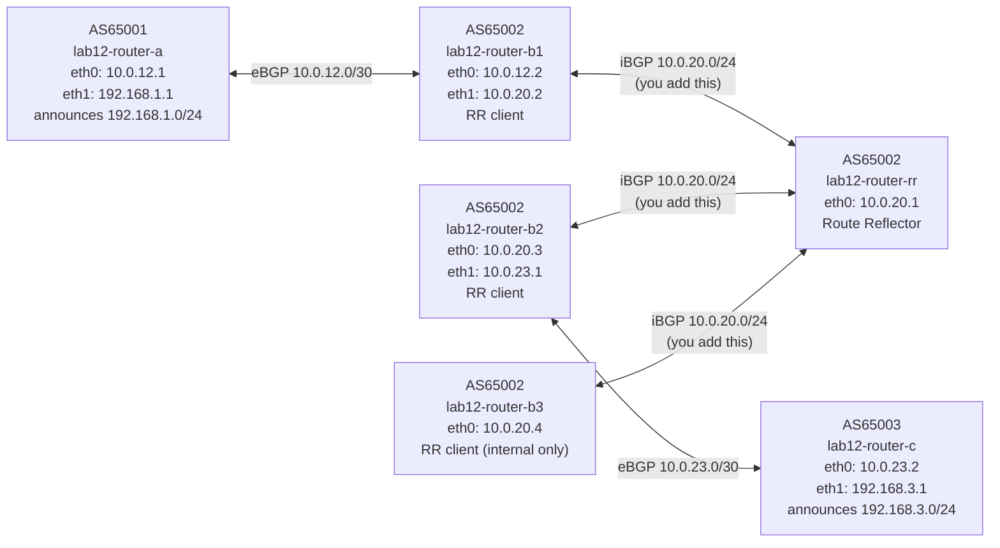

# Lab 12: Route Reflector

## Objectives

- Understand why iBGP full mesh doesn't scale past a small number of routers
- Configure a route reflector (RR) and designate clients with `route-reflector-client`
- Observe the ORIGINATOR_ID and CLUSTER_LIST path attributes added by the RR
- Verify that a purely internal router (no eBGP peers) receives external routes via the RR
- Understand loop prevention in route reflector deployments

## Concepts

**The full mesh problem:** In Lab 11 you built a two-router iBGP full mesh. With 2 iBGP routers you need 1 session. With 4 routers you need 6. With 10 routers: 45. The formula is N*(N-1)/2 — it grows quadratically. Large ISPs may have hundreds of iBGP speakers; full mesh is impractical.

**Route Reflector (RR):** A designated iBGP router that is permitted to break the split-horizon rule. Normally, a route learned from an iBGP peer is never re-advertised to another iBGP peer. An RR is configured with a set of *clients* and may re-advertise routes between them. Instead of N*(N-1)/2 sessions, each client needs only one session — to the RR. The RR itself does not forward data-plane traffic; it only redistributes routing information.

**RR topology in this lab:** AS65002 has four iBGP routers:
- **router-rr** — the route reflector (no eBGP peers)
- **router-b1** — RR client; eBGP border toward AS65001
- **router-b2** — RR client; eBGP border toward AS65003
- **router-b3** — RR client; purely internal (no eBGP peers at all)

Without the RR, b3 would learn nothing. With the RR, b3 peers with router-rr and receives routes that b1 and b2 learned externally — 3 sessions total instead of 6.

**Loop prevention:** Because the RR breaks split-horizon, new attributes prevent loops:
- **ORIGINATOR_ID** — set by the RR to the router-id of the router that originally sent the route. If a router receives a route with its own router-id in ORIGINATOR_ID, it discards it.
- **CLUSTER_LIST** — a list of RR cluster IDs the route has passed through. Prevents loops in multi-RR topologies (not covered here, but visible in `show bgp` output).

**next-hop-self:** Border routers (b1, b2) must still advertise `next-hop-self` toward the RR so that internal routers can resolve the next-hop. The RR passes this rewritten next-hop through to all clients.

## Topology



All AS65002 routers share the `lab12-as2-core` network (`10.0.20.0/24`) and can reach each other directly — no dedicated point-to-point links needed for iBGP.

## Setup

```bash
bash setup.sh
```

The eBGP sessions (router-a ↔ router-b1 and router-b2 ↔ router-c) come up automatically. No iBGP sessions exist in AS65002 — you will configure them all.

## Exercises

### Exercise 1 — Observe the broken state

```bash
# b1 learns 192.168.1.0/24 from AS65001 — check its BGP table
podman exec lab12-router-b1 vtysh -c "show bgp ipv4 unicast"

# b2 learns 192.168.3.0/24 from AS65003 — check its BGP table
podman exec lab12-router-b2 vtysh -c "show bgp ipv4 unicast"

# b3 knows nothing — no iBGP peers
podman exec lab12-router-b3 vtysh -c "show bgp ipv4 unicast"

# RR knows nothing — no eBGP or iBGP peers yet
podman exec lab12-router-rr vtysh -c "show bgp ipv4 unicast"
```

### Exercise 2 — Configure iBGP sessions to the RR (clients only, no RR config yet)

Add one iBGP session on each client pointing at the RR (10.0.20.1). Also add the session on the RR side — but do **not** add `route-reflector-client` yet. This lets you observe the split-horizon block before you fix it.

```bash
# On router-b1
podman exec -it lab12-router-b1 vtysh
  configure terminal
  router bgp 65002
    neighbor 10.0.20.1 remote-as 65002
    address-family ipv4 unicast
      neighbor 10.0.20.1 activate
      neighbor 10.0.20.1 next-hop-self
    exit-address-family
  end
  write memory
  exit

# On router-b2
podman exec -it lab12-router-b2 vtysh
  configure terminal
  router bgp 65002
    neighbor 10.0.20.1 remote-as 65002
    address-family ipv4 unicast
      neighbor 10.0.20.1 activate
      neighbor 10.0.20.1 next-hop-self
    exit-address-family
  end
  write memory
  exit

# On router-b3
podman exec -it lab12-router-b3 vtysh
  configure terminal
  router bgp 65002
    neighbor 10.0.20.1 remote-as 65002
    address-family ipv4 unicast
      neighbor 10.0.20.1 activate
    exit-address-family
  end
  write memory
  exit

# On router-rr — accept sessions but do NOT add route-reflector-client yet
podman exec -it lab12-router-rr vtysh
  configure terminal
  router bgp 65002
    neighbor 10.0.20.2 remote-as 65002
    neighbor 10.0.20.3 remote-as 65002
    neighbor 10.0.20.4 remote-as 65002
    address-family ipv4 unicast
      neighbor 10.0.20.2 activate
      neighbor 10.0.20.3 activate
      neighbor 10.0.20.4 activate
    exit-address-family
  end
  write memory
  exit
```

Now check the RR's BGP table:

```bash
podman exec lab12-router-rr vtysh -c "show bgp ipv4 unicast"
# RR sees 192.168.1.0/24 (from b1) and 192.168.3.0/24 (from b2)

podman exec lab12-router-b3 vtysh -c "show bgp ipv4 unicast"
# b3 sees NOTHING — the RR learned these routes from iBGP peers and will NOT re-advertise them (split-horizon)
```

### Exercise 3 — Enable route reflection

Add `route-reflector-client` on the RR for each client:

```bash
podman exec -it lab12-router-rr vtysh
  configure terminal
  router bgp 65002
    address-family ipv4 unicast
      neighbor 10.0.20.2 route-reflector-client
      neighbor 10.0.20.3 route-reflector-client
      neighbor 10.0.20.4 route-reflector-client
    exit-address-family
  end
  write memory
  exit
```

Within a few seconds, all clients receive all routes:

```bash
podman exec lab12-router-b3 vtysh -c "show bgp ipv4 unicast"
# Now sees 192.168.1.0/24 AND 192.168.3.0/24 — via the RR
```

### Exercise 4 — Inspect RR path attributes

Look at the ORIGINATOR_ID and CLUSTER_LIST attributes added by the RR:

```bash
podman exec lab12-router-b3 vtysh -c "show bgp ipv4 unicast 192.168.1.0/24"
```

Expected output includes:
```
  Originator: 10.0.20.2, Cluster list: 10.0.20.1
```

- **Originator** (`10.0.20.2`) — the router-id of router-b1, which originally sent the route to the RR
- **Cluster list** (`10.0.20.1`) — the RR's router-id, stamped as the route passed through

If b3 ever received a route with its own router-id in Originator, it would discard it — this is how RR loop prevention works without AS_PATH.

### Exercise 5 — Verify end-to-end reachability

```bash
# b3 (internal router, no eBGP) can now reach both external ASes via the RR
podman exec lab12-router-b3 ping -c 5 192.168.1.1
podman exec lab12-router-b3 ping -c 5 192.168.3.1

# Full cross-AS reachability
podman exec lab12-router-a ping -c 5 192.168.3.1
podman exec lab12-router-c ping -c 5 192.168.1.1
```

## Verification

```bash
# BGP summary on the RR — should show 3 clients, all Established
podman exec lab12-router-rr vtysh -c "show bgp summary"

# Confirm b3 has routes with ORIGINATOR_ID and CLUSTER_LIST
podman exec lab12-router-b3 vtysh -c "show bgp ipv4 unicast 192.168.1.0/24"
podman exec lab12-router-b3 vtysh -c "show bgp ipv4 unicast 192.168.3.0/24"

# Confirm route is installed in kernel on b3 (B> = BGP best, installed in FIB)
podman exec lab12-router-b3 vtysh -c "show ip route"

# Session counts: b1/b2/b3 each have 1 iBGP session (to RR); RR has 3
podman exec lab12-router-b1 vtysh -c "show bgp summary"
podman exec lab12-router-b2 vtysh -c "show bgp summary"
```

## Troubleshooting

**b3 still has no routes after adding `route-reflector-client`:**
- Check that all four `neighbor` statements on the RR are in `address-family ipv4 unicast` and activated
- Verify sessions are Established: `podman exec lab12-router-rr vtysh -c "show bgp summary"`
- Clear sessions if needed: `podman exec lab12-router-rr vtysh -c "clear bgp * soft"`

**b3 routes appear in BGP table but not in `show ip route`:**
- b3 received the route with a next-hop of `10.0.20.2` (b1) or `10.0.20.3` (b2). All AS65002 routers share the `10.0.20.0/24` core network, so those next-hops should be directly reachable. Confirm: `podman exec lab12-router-b3 ping -c 1 10.0.20.2`

**RR not re-advertising routes (Exercise 2 state persists after Exercise 3):**
- The `route-reflector-client` command must be inside `address-family ipv4 unicast`, not at the `router bgp` level. Verify with `podman exec lab12-router-rr vtysh -c "show running-config"` — look for `neighbor 10.0.20.2 route-reflector-client` under the address-family block.

**ORIGINATOR_ID missing from `show bgp` output:**
- FRR only adds ORIGINATOR_ID when the route is reflected (i.e., re-advertised from one client to another). If you're looking at the route on b1 itself, it won't have the attribute — b1 originated the advertisement to the RR. Check b3's view of the route instead.
