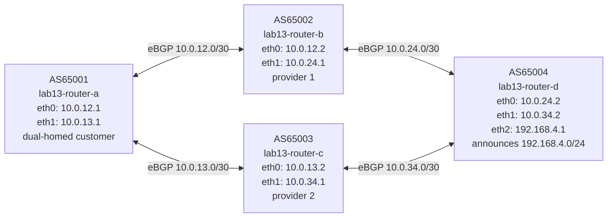

# Lab 13: BGP Path Selection

## Objectives

- Understand the ordered criteria BGP uses to select the best path
- Use LOCAL_PREF to control outbound traffic preference on a dual-homed router
- Use AS_PATH prepending to influence inbound traffic from upstream providers
- Understand MED and its "same neighboring AS" comparison rule
- Read `show bgp ipv4 unicast <prefix>` to identify which criterion decided the winner

## Concepts

When a BGP router has multiple paths to the same prefix, it runs them through a **decision process** in strict order, stopping at the first criterion where one path is better. Understanding this order is essential for traffic engineering.

### BGP Decision Process (simplified, in order)

| Step | Criterion | Prefer | Who sets it |
|------|-----------|--------|-------------|
| 1 | WEIGHT | Higher | Local only (Cisco/FRR, not in RFC) |
| 2 | LOCAL_PREF | Higher | Set within your AS on inbound eBGP |
| 3 | Locally originated | Local > learned | `network` or `redistribute` |
| 4 | AS_PATH length | Shorter | Set by path prepending |
| 5 | ORIGIN | IGP < EGP < Incomplete | Set by originating AS |
| 6 | MED | Lower | Set by neighboring AS on outbound |
| 7 | eBGP vs iBGP | eBGP preferred | Path type |
| 8 | IGP metric to next-hop | Lower | Interior routing |
| 9 | Router-ID of peer | Lower | Tiebreaker |

**LOCAL_PREF** is the most common tool for outbound traffic engineering — it's an iBGP attribute set locally when a route arrives from an eBGP peer. Higher wins.

**AS_PATH prepending** is the most common tool for inbound traffic engineering — you repeat your own AS number in the AS_PATH when advertising to a provider, making that path look longer and therefore less preferred by remote routers.

**MED (Multi-Exit Discriminator)** is a hint from one AS to another about which entry point to prefer. Important constraint: by default, BGP only compares MEDs between paths that came from the **same neighboring AS**. Paths from different ASes skip the MED comparison entirely unless `bgp always-compare-med` is configured.

## Topology



All sessions are pre-configured. router-a receives `192.168.4.0/24` via two independent paths:
- **Via router-b (AS65002):** AS_PATH `[65002, 65004]`
- **Via router-c (AS65003):** AS_PATH `[65003, 65004]`

Both paths have equal AS_PATH length. router-a must pick one. This lab explores how to control that choice.

## Setup

```bash
bash setup.sh
```

All four eBGP sessions come up automatically. router-d announces `192.168.4.0/24` to both providers.

## Exercises

### Exercise 1 — Observe default path selection (router-ID tiebreaker)

```bash
podman exec lab13-router-a vtysh -c "show bgp ipv4 unicast 192.168.4.0/24"
```

You will see two paths. The `>` marker indicates the selected path. With all other criteria equal, BGP falls through to step 9: **lowest peer router-ID**. router-b's router-id is `10.0.12.2`, router-c's is `10.0.13.2`. Lower wins, so **router-b's path is selected by default**.

Look for the line `Local pref: 100` on both paths — the default LOCAL_PREF is 100 on both, so that criterion produces a tie and BGP moves on.

```bash
# Confirm active path is via 10.0.12.2 (router-b)
podman exec lab13-router-a vtysh -c "show ip route 192.168.4.0/24"
```

### Exercise 2 — LOCAL_PREF: prefer provider 2

LOCAL_PREF is set on router-a when a route arrives from an eBGP peer. Apply a route-map to the router-c session to set LOCAL_PREF=200 (higher than the default 100 on the router-b path):

```bash
podman exec -it lab13-router-a vtysh
  configure terminal
  route-map PREFER-C in
   set local-preference 200
  exit
  router bgp 65001
   address-family ipv4 unicast
    neighbor 10.0.13.2 route-map PREFER-C in
   exit-address-family
  end
  clear bgp 10.0.13.2 soft in
  exit
```

Check the result:

```bash
podman exec lab13-router-a vtysh -c "show bgp ipv4 unicast 192.168.4.0/24"
# Expected: path via 10.0.13.2 (router-c) now has Local pref: 200 and is selected (>)
```

**Why this matters:** LOCAL_PREF is how a dual-homed customer tells all of its internal routers "use provider 2 for outbound traffic to this prefix." It propagates across iBGP so every router in the AS agrees.

**Reset before next exercise:**

```bash
podman exec -it lab13-router-a vtysh
  configure terminal
  router bgp 65001
   address-family ipv4 unicast
    no neighbor 10.0.13.2 route-map PREFER-C in
   exit-address-family
  end
  clear bgp 10.0.13.2 soft in
  exit
```

### Exercise 3 — AS_PATH prepending: make provider 1's path less preferred

AS_PATH prepending adds extra copies of your own AS number to the path you advertise, making it look longer to remote routers. Here, router-b will prepend AS65002 twice when advertising to router-a, making its path length 4 vs. router-c's length 2:

```bash
podman exec -it lab13-router-b vtysh
  configure terminal
  route-map PREPEND-TO-A out
   set as-path prepend 65002 65002
  exit
  router bgp 65002
   address-family ipv4 unicast
    neighbor 10.0.12.1 route-map PREPEND-TO-A out
   exit-address-family
  end
  clear bgp 10.0.12.1 soft out
  exit
```

```bash
podman exec lab13-router-a vtysh -c "show bgp ipv4 unicast 192.168.4.0/24"
# Path via router-b: AS_PATH 65002 65002 65002 65004 (length 4)
# Path via router-c: AS_PATH 65003 65004 (length 2)
# router-c path is now selected — shorter AS_PATH wins at step 4
```

**Why this matters:** AS_PATH prepending is the primary way a multi-homed network tells the internet "prefer entering via my other provider." The AS originating the prefix controls how attractive each upstream's path appears.

**Reset before next exercise:**

```bash
podman exec -it lab13-router-b vtysh
  configure terminal
  router bgp 65002
   address-family ipv4 unicast
    no neighbor 10.0.12.1 route-map PREPEND-TO-A out
   exit-address-family
  end
  clear bgp 10.0.12.1 soft out
  exit
```

### Exercise 4 — MED: provider preference for inbound traffic

MED is set by the **advertising AS** (router-d in this case) to hint to its peers which entry point it prefers. Lower MED wins. Configure router-d to advertise a low MED toward router-b and a high MED toward router-c:

```bash
podman exec -it lab13-router-d vtysh
  configure terminal
  route-map MED-LOW out
   set metric 50
  exit
  route-map MED-HIGH out
   set metric 200
  exit
  router bgp 65004
   address-family ipv4 unicast
    neighbor 10.0.24.1 route-map MED-LOW out
    neighbor 10.0.34.1 route-map MED-HIGH out
   exit-address-family
  end
  clear bgp * soft out
  exit
```

Now check router-a:

```bash
podman exec lab13-router-a vtysh -c "show bgp ipv4 unicast 192.168.4.0/24"
```

**The MED values are visible but the path selection does NOT change.** This is the key MED caveat: BGP only compares MEDs between paths from the **same neighboring AS**. router-a's two paths come from AS65002 and AS65003 — different ASes — so the MED comparison is skipped entirely.

To override this, enable `bgp always-compare-med` on router-a:

```bash
podman exec -it lab13-router-a vtysh
  configure terminal
  router bgp 65001
   bgp always-compare-med
  end
  clear bgp * soft
  exit
```

```bash
podman exec lab13-router-a vtysh -c "show bgp ipv4 unicast 192.168.4.0/24"
# Now MED is compared: 50 (via router-b) < 200 (via router-c)
# router-b's path is selected — MED=50 wins (lower is better)
```

**In practice:** `always-compare-med` is rarely enabled in production because it compares MEDs set by different operators who may use different conventions. Most operators rely on LOCAL_PREF (inbound policy, steps 1-2) rather than MED for path selection.

## Verification

```bash
# See both paths and the active selection
podman exec lab13-router-a vtysh -c "show bgp ipv4 unicast 192.168.4.0/24"

# Confirm which next-hop is in the kernel routing table
podman exec lab13-router-a vtysh -c "show ip route 192.168.4.0/24"

# Show BGP session summary
podman exec lab13-router-a vtysh -c "show bgp summary"
```

In `show bgp ipv4 unicast <prefix>`, look for:
- `>` — this path is selected (best)
- `Local pref: N` — LOCAL_PREF value
- `AS_PATH: 65002 65004` — the path's AS sequence
- `Metric: N` — MED value (if set)

## Troubleshooting

**Only one path shows in `show bgp ipv4 unicast 192.168.4.0/24`:**
- The second path may not have established yet. Check `show bgp summary` — all four sessions should be Established.
- If a session is stuck, check: `podman exec lab13-router-a vtysh -c "show bgp neighbors 10.0.12.2"` for the error state.

**Path doesn't change after applying route-map:**
- Route-maps applied with `in` take effect after a soft reset of that session: `clear bgp <peer-ip> soft in`
- Route-maps applied with `out` need a soft reset on the advertising router: `clear bgp <peer-ip> soft out`
- Confirm the route-map is applied: `show running-config | grep route-map`

**After resetting LOCAL_PREF, the tiebreaker doesn't revert to router-b:**
- Both paths must be truly equal for router-id to decide. If a previous route-map is still applied, it will still bias LOCAL_PREF. Check: `show running-config` on router-a for any remaining `neighbor ... route-map` lines.

**MED changes not visible after `clear bgp * soft out` on router-d:**
- Wait a few seconds for the UPDATE to propagate to router-a, then re-run `show bgp ipv4 unicast 192.168.4.0/24` on router-a.
