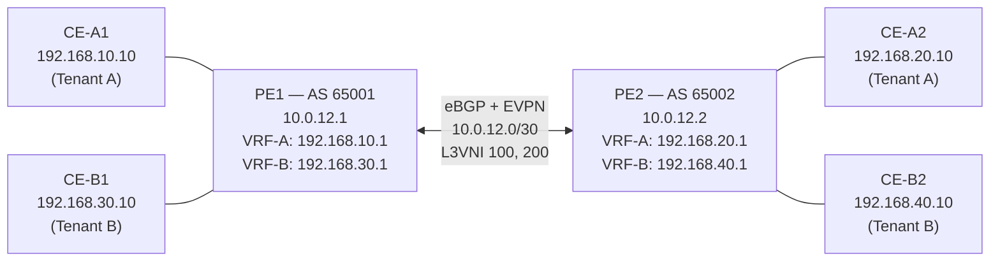

# Lab 14: L3VPN / VRF Route Leaking

## Objectives

- Understand how Linux VRFs provide Layer 3 tenant isolation on a shared PE router
- Read and explain FRR's EVPN symmetric IRB configuration (VNI bindings, RD, RT)
- Verify that cross-VTEP routes within the same VRF work via EVPN type-5
- Configure controlled inter-VRF route leaking using BGP route targets
- Apply a prefix-list filter to leak only selected prefixes between VRFs

## Concepts

### VRF (Virtual Routing and Forwarding)

A VRF is a separate routing table in the Linux kernel. Traffic in VRF-A cannot reach VRF-B unless explicitly allowed — even on the same router. Service providers use VRFs to carry multiple customers on shared PE hardware, similar to VLANs at Layer 2.

### Route Distinguisher (RD)

The RD makes a prefix globally unique in BGP. `65001:100` prepended to `192.168.10.0/24` becomes a VPNv4 route that cannot be confused with the same prefix from another customer.

### Route Target (RT)

The RT is the import/export policy. When a VRF advertises a prefix with RT `65001:100`, any VRF configured to import `65001:100` will pull that prefix into its routing table. This is the knob for controlled route leaking.

### EVPN Symmetric IRB

EVPN type-5 (IP Prefix) routes carry VRF prefixes across VTEPs. "Symmetric IRB" means the packet is routed at both the ingress VTEP (into VXLAN) and the egress VTEP (out of VXLAN), using a shared L3VNI per VRF. Each VRF gets one L3VNI:
- VRF-A → L3VNI 100
- VRF-B → L3VNI 200

## Topology



| Container | Role | IP(s) |
|-----------|------|--------|
| lab14-pe1 | Provider Edge 1 (AS 65001) | eth0: 10.0.12.1, VRF-A eth1: 192.168.10.1, VRF-B eth2: 192.168.30.1 |
| lab14-pe2 | Provider Edge 2 (AS 65002) | eth0: 10.0.12.2, VRF-A eth1: 192.168.20.1, VRF-B eth2: 192.168.40.1 |
| lab14-ce-a1 | Tenant A host at PE1 | 192.168.10.10 |
| lab14-ce-a2 | Tenant A host at PE2 | 192.168.20.10 |
| lab14-ce-b1 | Tenant B host at PE1 | 192.168.30.10 |
| lab14-ce-b2 | Tenant B host at PE2 | 192.168.40.10 |

## Setup

```bash
./setup.sh
```

`setup.sh` does the following:
1. Creates five Podman networks (one underlay, four CE-to-PE links)
2. Starts PE1 and PE2 with pre-configured FRR (eBGP underlay + EVPN)
3. Starts CE host containers
4. Creates kernel VRFs (`vrf-a` table 100, `vrf-b` table 200) on both PEs
5. Enslaves CE-facing interfaces into their VRFs and re-adds gateway IPs
6. Creates VXLAN L3VNI interfaces (`vxlan100`, `vxlan200`) and bridges for EVPN symmetric IRB

## Exercises

### Exercise 1: Examine the Pre-Configured Setup

Read the FRR config on PE1:

```bash
podman exec lab14-pe1 vtysh -c "show running-config"
```

Key sections to understand:

- `vrf VRF-A vni 100` — binds VRF-A to L3VNI 100 for EVPN
- `address-family l2vpn evpn / advertise-all-vni` — enables EVPN, advertises all VNIs
- Under `router bgp 65001 vrf VRF-A`:
  - `rd vpn export 65001:100` — unique RD for Tenant A routes from PE1
  - `rt vpn both 65001:100` — export and import routes tagged with RT 65001:100
  - `export vpn / import vpn` — activates VPN integration in this VRF BGP instance

Check the kernel VRF setup:

```bash
podman exec lab14-pe1 ip vrf show
podman exec lab14-pe1 ip route show vrf vrf-a
podman exec lab14-pe1 ip -d link show vxlan100
```

### Exercise 2: Verify BGP Peering and EVPN Routes

Check that the underlay BGP session and EVPN session are both established:

```bash
podman exec lab14-pe1 vtysh -c "show bgp summary"
```

You should see `Established` for the PE1-PE2 peer. Check EVPN type-5 routes:

```bash
podman exec lab14-pe1 vtysh -c "show bgp l2vpn evpn route type prefix"
```

You should see type-5 routes for `192.168.20.0/24` (PE2 VRF-A) and `192.168.40.0/24` (PE2 VRF-B) received from PE2.

Check what FRR installed in the VRF routing table:

```bash
podman exec lab14-pe1 vtysh -c "show ip route vrf VRF-A"
```

Expected: `192.168.10.0/24` (local, connected) and `192.168.20.0/24` (EVPN, via 10.0.12.2).

### Exercise 3: Verify Same-VRF Cross-VTEP Reachability

Tenant A (VRF-A) should be able to reach across the VTEP boundary:

```bash
podman exec lab14-ce-a1 ping -c 3 192.168.20.10  # CE-A1 → CE-A2
podman exec lab14-ce-a2 ping -c 3 192.168.10.10  # CE-A2 → CE-A1
```

Tenant B:

```bash
podman exec lab14-ce-b1 ping -c 3 192.168.40.10  # CE-B1 → CE-B2
```

**Verify VRF isolation** — Tenant A cannot reach Tenant B (different RTs, no leaking yet):

```bash
podman exec lab14-ce-a1 ping -c 2 -W 2 192.168.30.10 && echo "UNEXPECTED REACH" || echo "Isolated as expected"
```

### Exercise 4: Add Route Leaking — VRF-A into VRF-B

The goal: Tenant B (VRF-B) gains read-only access to Tenant A prefixes. This is done by importing Tenant A's RT (`65001:100`) into VRF-B.

On PE1, enter `vtysh` and add the RT import:

```bash
podman exec -it lab14-pe1 vtysh
```

```
conf t
router bgp 65001 vrf VRF-B
 address-family ipv4 unicast
  rt vpn import 65001:100
exit
exit
write memory
```

Repeat on PE2:

```bash
podman exec -it lab14-pe2 vtysh
```

```
conf t
router bgp 65002 vrf VRF-B
 address-family ipv4 unicast
  rt vpn import 65001:100
exit
exit
write memory
```

### Exercise 5: Verify Route Leaking

After a few seconds, VRF-B on both PEs should have imported VRF-A prefixes:

```bash
podman exec lab14-pe1 vtysh -c "show ip route vrf VRF-B"
```

Expected: `192.168.10.0/24` and `192.168.20.0/24` now appear in VRF-B alongside VRF-B's own prefixes.

Test reachability from Tenant B to Tenant A:

```bash
podman exec lab14-ce-b1 ping -c 3 192.168.10.10  # CE-B1 → CE-A1
podman exec lab14-ce-b1 ping -c 3 192.168.20.10  # CE-B1 → CE-A2
```

Verify that Tenant A still cannot reach Tenant B (leaking is one-directional):

```bash
podman exec lab14-ce-a1 ping -c 2 -W 2 192.168.30.10 && echo "UNEXPECTED" || echo "Still isolated"
```

### Exercise 6: Filter the Leaked Routes with a Prefix-List

You want Tenant B to reach only Tenant A at PE1 (`192.168.10.0/24`), not at PE2 (`192.168.20.0/24`). Apply a prefix-list filter.

On both PEs:

```bash
podman exec -it lab14-pe1 vtysh
```

```
conf t
ip prefix-list LEAK-A-TO-B seq 10 permit 192.168.10.0/24

router bgp 65001 vrf VRF-B
 address-family ipv4 unicast
  neighbor 10.0.12.2 route-map ALLOW-A-LOCAL in
exit

route-map ALLOW-A-LOCAL permit 10
 match ip address prefix-list LEAK-A-TO-B
exit

write memory
```

Verify the filter is applied:

```bash
podman exec lab14-pe1 vtysh -c "show ip route vrf VRF-B"
# 192.168.10.0/24 should be present, 192.168.20.0/24 should be absent
```

## Verification

```bash
# BGP session + EVPN peer
podman exec lab14-pe1 vtysh -c "show bgp summary"

# EVPN type-5 routes received from PE2
podman exec lab14-pe1 vtysh -c "show bgp l2vpn evpn route type prefix"

# VRF-A routing table (shows cross-VTEP EVPN routes)
podman exec lab14-pe1 vtysh -c "show ip route vrf VRF-A"

# VRF-B routing table (shows leaked routes after Exercise 4)
podman exec lab14-pe1 vtysh -c "show ip route vrf VRF-B"

# Kernel VRF membership
podman exec lab14-pe1 ip vrf show
podman exec lab14-pe1 ip route show vrf vrf-a

# VXLAN L3VNI details
podman exec lab14-pe1 ip -d link show vxlan100
podman exec lab14-pe1 ip -d link show vxlan200
```

## Troubleshooting

**`ip link add vxlan100 ... : No such device`**

The `vxlan` kernel module is not loaded. On the host (not inside the container):

```bash
sudo modprobe vxlan
```

On macOS with Podman machine, this runs automatically in the VM — restart the machine if the module is missing.

**EVPN routes absent (`show bgp l2vpn evpn route` is empty)**

FRR needs the kernel VRF and VXLAN interface to be in place before it can advertise EVPN type-5. If setup.sh completed successfully but EVPN routes are missing, try:

```bash
podman exec lab14-pe1 vtysh -c "clear bgp *"
sleep 5
podman exec lab14-pe1 vtysh -c "show bgp l2vpn evpn route type prefix"
```

**`ip route show vrf vrf-a` is empty after setup**

FRR zebra needs to learn the interface VRF membership via netlink. Give it a few extra seconds after setup.sh completes, then re-check. If still empty:

```bash
podman exec lab14-pe1 vtysh -c "show interface eth1"
# Should show "VRF: VRF-A"
```

If it shows the default VRF, setup.sh may have failed mid-way. Re-run `teardown.sh` then `setup.sh`.

**Cross-VTEP ping fails even after EVPN converges**

Verify the VXLAN underlay route exists:

```bash
podman exec lab14-pe1 ip route show
# Should contain 10.0.12.2 (the remote VTEP) reachable via eth0
```

VXLAN encapsulation uses the underlay 10.0.12.0/30 link. If the ping fails, check that the underlay BGP route is in the default VRF:

```bash
podman exec lab14-pe1 vtysh -c "show ip route"
```

**Route leaking has no effect**

After adding `rt vpn import`, trigger a BGP soft reset:

```bash
podman exec lab14-pe1 vtysh -c "clear bgp * soft"
```

Then re-check `show ip route vrf VRF-B`.
