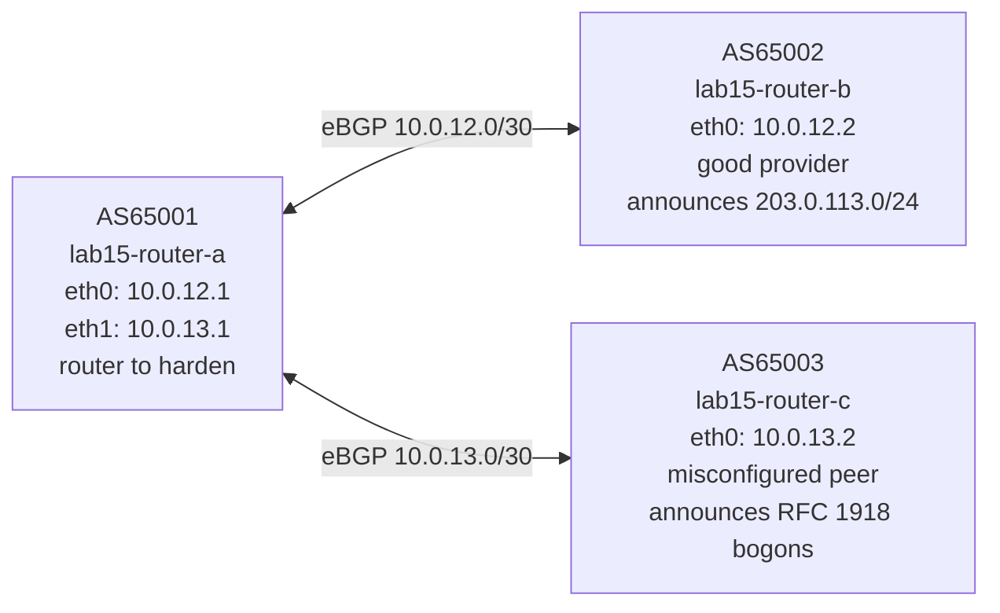

# Lab 15: Operational BGP — Bogon Filtering and Max-Prefix

## Objectives

- Understand why unfiltered BGP sessions are a security and stability risk
- Identify bogon prefixes (RFC 1918, IANA reserved, loopback, link-local)
- Build a prefix-list to reject bogon routes while permitting legitimate ones
- Configure `maximum-prefix` to protect against route leaks and session floods
- Observe and recover from a max-prefix triggered session shutdown

## Concepts

**Bogon prefixes** are IP prefixes that should never appear in the global BGP routing table. Accepting them is dangerous: a router that installs `10.0.0.0/8` from a BGP peer may start forwarding private traffic toward that peer, leaking internal communications or creating black holes. Common bogon categories:

| Prefix | Reason |
|--------|--------|
| `0.0.0.0/8` | "This" network (RFC 1122) |
| `10.0.0.0/8` | RFC 1918 private space |
| `100.64.0.0/10` | Shared Address Space (RFC 6598, carrier-grade NAT) |
| `127.0.0.0/8` | Loopback (RFC 1122) |
| `169.254.0.0/16` | Link-local / APIPA (RFC 3927) |
| `172.16.0.0/12` | RFC 1918 private space |
| `192.0.0.0/24` | IETF Protocol Assignments (RFC 6890) |
| `192.0.2.0/24` | TEST-NET-1 (RFC 5737, documentation only) |
| `192.168.0.0/16` | RFC 1918 private space |
| `198.18.0.0/15` | Network Benchmarking (RFC 2544) |
| `198.51.100.0/24` | TEST-NET-2 (RFC 5737, documentation only) |
| `203.0.113.0/24` | TEST-NET-3 (RFC 5737, documentation only) |
| `240.0.0.0/4` | Reserved / future use (RFC 1112) |
| `255.255.255.255/32` | Broadcast |

In this lab, `203.0.113.0/24` is used as the **legitimate** prefix from router-b (the well-behaved provider) to give the filter something valid to pass through. In a production deployment, all TEST-NET prefixes would also be blocked.

**Bogon filtering** uses a BGP prefix-list applied inbound on eBGP sessions. The list denies known bogon prefixes and ends with a catch-all permit for everything else. Without the trailing permit, BGP's implicit deny would drop all routes from the peer.

**Max-prefix** (`maximum-prefix N`) limits how many prefixes a peer may send. If the peer exceeds N, BGP tears down the session and logs a warning. This prevents a misconfigured neighbor from flooding your routing table with thousands of leaked routes — a real failure mode that has caused internet outages. FRR requires a manual `clear bgp <peer>` to re-establish the session after a max-prefix violation (by default; a restart timer can be configured).

## Topology



## Setup

```bash
bash setup.sh
```

Both sessions come up immediately. router-a currently accepts **everything** — including the bogon routes from router-c. Your job is to fix that.

## Exercises

### Exercise 1 — Observe the problem

```bash
podman exec lab15-router-a vtysh -c "show bgp ipv4 unicast"
```

You will see all five bogon prefixes from router-c (`10.0.0.0/8`, `100.64.0.0/10`, `172.16.0.0/12`, `192.0.2.0/24`, `192.168.0.0/16`) alongside the legitimate `203.0.113.0/24` from router-b. All are installed in router-a's routing table.

```bash
podman exec lab15-router-a vtysh -c "show ip route"
# Routes to 10.0.0.0/8 and 172.16.0.0/12 appear — router-a would forward
# traffic for RFC 1918 addresses toward router-c. This is the risk.
```

Check what router-c is sending:
```bash
podman exec lab15-router-c vtysh -c "show bgp ipv4 unicast"
```

### Exercise 2 — Build a bogon prefix-list

Create a prefix-list on router-a that denies known bogons and permits everything else. Apply it inbound on the router-c session.

```bash
podman exec -it lab15-router-a vtysh
  configure terminal

  ip prefix-list BOGON-FILTER seq 10  deny 0.0.0.0/8 le 32
  ip prefix-list BOGON-FILTER seq 20  deny 10.0.0.0/8 le 32
  ip prefix-list BOGON-FILTER seq 30  deny 100.64.0.0/10 le 32
  ip prefix-list BOGON-FILTER seq 40  deny 127.0.0.0/8 le 32
  ip prefix-list BOGON-FILTER seq 50  deny 169.254.0.0/16 le 32
  ip prefix-list BOGON-FILTER seq 60  deny 172.16.0.0/12 le 32
  ip prefix-list BOGON-FILTER seq 70  deny 192.0.0.0/24 le 32
  ip prefix-list BOGON-FILTER seq 80  deny 192.0.2.0/24 le 32
  ip prefix-list BOGON-FILTER seq 90  deny 192.168.0.0/16 le 32
  ip prefix-list BOGON-FILTER seq 100 deny 198.18.0.0/15 le 32
  ip prefix-list BOGON-FILTER seq 110 deny 198.51.100.0/24 le 32
  ip prefix-list BOGON-FILTER seq 120 deny 240.0.0.0/4 le 32
  ip prefix-list BOGON-FILTER seq 130 deny 255.255.255.255/32
  ip prefix-list BOGON-FILTER seq 999 permit 0.0.0.0/0 le 32

  router bgp 65001
   address-family ipv4 unicast
    neighbor 10.0.13.2 prefix-list BOGON-FILTER in
   exit-address-family
  end
  clear bgp 10.0.13.2 soft in
  exit
```

**The trailing `permit 0.0.0.0/0 le 32` is critical.** Prefix-lists have an implicit deny-all at the end. Without seq 999, the filter would reject every route from router-c — including any legitimate ones it might send in future. The `le 32` matches the prefix itself AND any more-specific route (e.g., `10.1.2.0/24` is covered by `deny 10.0.0.0/8 le 32`).

### Exercise 3 — Verify the filter

```bash
# Bogons from router-c should now be gone
podman exec lab15-router-a vtysh -c "show bgp ipv4 unicast"

# Legitimate prefix from router-b still present
podman exec lab15-router-a vtysh -c "show bgp ipv4 unicast 203.0.113.0/24"

# Bogon routes no longer in kernel routing table
podman exec lab15-router-a vtysh -c "show ip route"

# See which prefixes were filtered (shows received-routes vs accepted)
podman exec lab15-router-a vtysh -c "show bgp neighbors 10.0.13.2 received-routes"
podman exec lab15-router-a vtysh -c "show bgp neighbors 10.0.13.2 routes"
# received-routes: all 5 bogons are listed (router-c still sends them)
# routes: empty — none accepted after the filter
```

### Exercise 4 — Configure max-prefix on the router-c session

Even with bogon filtering, a peer could suddenly advertise thousands of routes (a route leak). Set a max-prefix limit of 10 prefixes on the router-c session — well above the 5 bogons it currently sends, but with a warning threshold:

```bash
podman exec -it lab15-router-a vtysh
  configure terminal
  router bgp 65001
   address-family ipv4 unicast
    neighbor 10.0.13.2 maximum-prefix 10 80
   exit-address-family
  end
  exit
```

The `80` sets a warning threshold at 80% (8 prefixes) — FRR will log a warning before the hard limit is hit. Check the session is still up:

```bash
podman exec lab15-router-a vtysh -c "show bgp summary"
```

### Exercise 5 — Trigger a max-prefix violation

Flood router-c with more prefixes than the limit by adding network statements:

```bash
podman exec -it lab15-router-c vtysh
  configure terminal
  router bgp 65003
   address-family ipv4 unicast
    network 198.51.100.0/24
    network 198.18.0.0/15
    network 169.254.0.0/16
    network 127.0.0.0/8
    network 0.0.0.0/8
    network 240.0.0.0/4
   exit-address-family
  end
  exit
```

Watch the session on router-a:

```bash
podman exec lab15-router-a vtysh -c "show bgp summary"
# The router-c session will show "Idle (PfxCt)" — shut down by max-prefix
```

Check the log:

```bash
podman exec lab15-router-a vtysh -c "show log"
# Look for: "NOTIFICATION sent ... maximum number of prefixes reached"
```

### Exercise 6 — Recover from max-prefix shutdown

The session does not reconnect automatically (default behavior). You must manually clear it:

```bash
podman exec lab15-router-a vtysh -c "clear bgp 10.0.13.2"
sleep 3
podman exec lab15-router-a vtysh -c "show bgp summary"
# Session re-establishes but immediately shuts down again — router-c is still
# advertising 11 prefixes, which exceeds the limit of 10
```

To prevent this loop, either fix the peer or temporarily remove the max-prefix to investigate:

```bash
podman exec -it lab15-router-a vtysh
  configure terminal
  router bgp 65001
   address-family ipv4 unicast
    no neighbor 10.0.13.2 maximum-prefix
   exit-address-family
  end
  clear bgp 10.0.13.2
  exit
```

**In production:** when a peer trips your max-prefix limit, the correct response is to contact the peer's NOC — not to remove the limit. The limit is protecting you from their mistake.

## Verification

```bash
# Confirm bogon filter is active (no RFC 1918 in BGP table)
podman exec lab15-router-a vtysh -c "show bgp ipv4 unicast" | grep -E "10\.|172\.16|192\.168|100\.64|192\.0\.2"
# Expected: no output (all filtered)

# Confirm legitimate prefix from router-b still accepted
podman exec lab15-router-a vtysh -c "show bgp ipv4 unicast 203.0.113.0/24"

# Show prefix-list (verify your filter definition)
podman exec lab15-router-a vtysh -c "show ip prefix-list BOGON-FILTER"

# Show which neighbors have prefix-list applied
podman exec lab15-router-a vtysh -c "show bgp neighbors 10.0.13.2" | grep prefix-list
```

## Troubleshooting

**All routes from router-c disappear after applying the prefix-list (including ones that should be allowed):**
- The `permit 0.0.0.0/0 le 32` catch-all at seq 999 is missing. Without it, the implicit deny blocks everything.
- Check: `show ip prefix-list BOGON-FILTER` — the last entry must be `permit 0.0.0.0/0 le 32`.

**Bogons still appear after `clear bgp 10.0.13.2 soft in`:**
- Confirm the prefix-list is applied to the correct neighbor: `show bgp neighbors 10.0.13.2 | grep prefix-list`
- Confirm the prefix-list name matches exactly: prefix-lists are case-sensitive.

**Max-prefix session stays in Idle after `clear bgp`:**
- router-c is still over the limit. Either fix router-c's advertisements or temporarily raise/remove the limit to investigate, then lower it again once the peer is corrected.

**`show bgp neighbors received-routes` shows nothing:**
- FRR requires `neighbor 10.0.13.2 soft-reconfiguration inbound` to store received routes before filtering. Without it, you can only see what was accepted, not what was rejected. Add it and do a soft reset.
