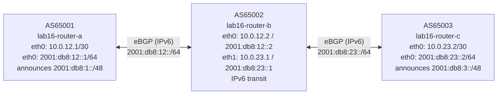

# Lab 16: BGP with IPv6

## Objectives

- Configure eBGP sessions that peer over IPv6 global addresses
- Understand the `address-family ipv6 unicast` block and the `activate` requirement
- Read `show bgp ipv6 unicast` and understand IPv6 next-hop structure
- Verify end-to-end IPv6 reachability across a transit AS
- Add dual-stack: carry both IPv4 and IPv6 NLRI on the same BGP session

## Concepts

**IPv6 in BGP** is carried by the same BGP protocol, but as a separate **address family**. A BGP session that was originally designed for IPv4 carries IPv6 routes as a multiprotocol extension (RFC 4760). The session itself can use either IPv4 or IPv6 transport; the address family determines what prefixes are exchanged.

**Two common patterns:**
- **IPv6-peered, IPv6 NLRI** (this lab): the TCP session is established over IPv6 addresses. Only IPv6 routes are exchanged by default. This is the native IPv6 approach.
- **IPv4-peered, IPv6 NLRI (MP-BGP)**: the TCP session uses IPv4 addresses, but the session is extended to carry IPv6 routes via the multiprotocol capability. Common when an IPv4-only underlay must carry IPv6 routing information.

**`activate`**: In FRR, adding a neighbor to BGP does not automatically include them in all address families. You must explicitly `activate` each neighbor inside the address family you want them to participate in. Without `activate` in `address-family ipv6 unicast`, no IPv6 routes are exchanged with that peer, even if the session is Established.

**`no bgp network import-check`**: By default, FRR verifies that a prefix you announce with `network` exists in the routing table before advertising it. In this lab, `2001:db8:1::/48` and `2001:db8:3::/48` are not locally connected routes. `no bgp network import-check` tells FRR to announce them anyway. In production, you would create a static null route (`ipv6 route 2001:db8:1::/48 Null0`) to originate the prefix legitimately.

**IPv6 next-hop**: For IPv6 routes, BGP advertises both a **global** next-hop (e.g., `2001:db8:12::2`) and optionally a **link-local** next-hop (e.g., `fe80::...`). FRR uses the global next-hop for route installation when a global address is available. When peering over link-local addresses (unnumbered BGP), only the link-local next-hop is available.

**`net.ipv6.conf.all.forwarding=1`**: IPv6 forwarding must be explicitly enabled in the kernel, separate from IPv4 forwarding. This lab's `setup.sh` enables it via `--sysctl net.ipv6.conf.all.forwarding=1` on each container.

## Topology



Each link has both an IPv4 address (assigned by Podman) and an IPv6 address (configured by FRR). The BGP sessions peer over the IPv6 global addresses.

## Setup

```bash
bash setup.sh
```

Wait 8 seconds after startup — IPv6 address assignment and neighbor discovery take slightly longer than IPv4.

## Exercises

### Exercise 1 — Inspect the IPv6 BGP table

```bash
# Show the IPv6 unicast routing table on router-a
podman exec lab16-router-a vtysh -c "show bgp ipv6 unicast"
```

You will see two entries:
- `2001:db8:1::/48` — locally originated (marked with `>*` and next-hop `::`)
- `2001:db8:3::/48` — learned from router-b (next-hop `2001:db8:12::2`)

Compare to the IPv4 table — it is empty because no IPv4 prefixes are being announced:
```bash
podman exec lab16-router-a vtysh -c "show bgp ipv4 unicast"
```

Check session state for the IPv6 address family specifically:
```bash
podman exec lab16-router-a vtysh -c "show bgp ipv6 unicast summary"
# Should show: 1 neighbor, Established, prefixes sent and received
```

### Exercise 2 — Understand the next-hop structure

Examine a specific route in detail:

```bash
podman exec lab16-router-a vtysh -c "show bgp ipv6 unicast 2001:db8:3::/48"
```

Expected output includes:
```
  Route 2001:db8:3::/48
    ...
    Nexthop: 2001:db8:12::2
    ...
    AS_PATH: 65002 65003
```

The next-hop `2001:db8:12::2` is router-b's address on the a-b link — it is the directly reachable global IPv6 address router-b advertises when it re-advertises this route to router-a. Unlike the iBGP `next-hop-self` situation in Lab 11, eBGP automatically rewrites the next-hop to the advertising router's own address on the peering link.

Check the IPv6 routing table:
```bash
podman exec lab16-router-a vtysh -c "show ipv6 route"
# B> 2001:db8:3::/48 [20/0] via 2001:db8:12::2, eth0, ...
```

### Exercise 3 — Verify end-to-end IPv6 reachability

```bash
# From router-a: ping router-b's far-side address
podman exec lab16-router-a ping -6 -c 3 2001:db8:23::1

# From router-a: ping router-c's peering address
podman exec lab16-router-a ping -6 -c 3 2001:db8:23::2

# Ping into the announced prefix (router-c's loopback-equivalent)
# Note: 2001:db8:3::1 is within 2001:db8:3::/48 but not a real interface —
# this ping will fail because there's no actual host to respond.
# The route IS installed; there's just no host at that address in this lab.
podman exec lab16-router-a ping -6 -c 3 2001:db8:3::1
```

The first two pings succeed (real interfaces exist at those addresses). The third illustrates that having a BGP route for a prefix does not mean every address in it has a live host — the route just enables the path.

### Exercise 4 — Add a more-specific prefix

Add a more-specific /56 announcement to router-a and watch it propagate:

```bash
podman exec -it lab16-router-a vtysh
  configure terminal
  router bgp 65001
   address-family ipv6 unicast
    network 2001:db8:1:100::/56
   exit-address-family
  end
  exit

# Check router-c receives the new /56 alongside the existing /48
podman exec lab16-router-c vtysh -c "show bgp ipv6 unicast"
# Expected: both 2001:db8:1::/48 and 2001:db8:1:100::/56 from AS65001
```

### Exercise 5 — Dual-stack: add IPv4 NLRI to the IPv6 session

The same IPv6 BGP session can carry IPv4 routes too, using multiprotocol extensions. Add IPv4 address family on all three routers and announce a test IPv4 prefix from router-c:

```bash
# On router-c: announce an IPv4 prefix via the IPv6 BGP session
podman exec -it lab16-router-c vtysh
  configure terminal
  router bgp 65003
   address-family ipv4 unicast
    no bgp network import-check
    network 203.0.113.0/24
    neighbor 2001:db8:23::1 activate
   exit-address-family
  end
  exit

# On router-b: activate router-c neighbor for IPv4 AF too
podman exec -it lab16-router-b vtysh
  configure terminal
  router bgp 65002
   address-family ipv4 unicast
    neighbor 2001:db8:23::2 activate
    neighbor 2001:db8:12::1 activate
   exit-address-family
  end
  exit

# On router-a: activate router-b neighbor for IPv4 AF
podman exec -it lab16-router-a vtysh
  configure terminal
  router bgp 65001
   address-family ipv4 unicast
    neighbor 2001:db8:12::2 activate
   exit-address-family
  end
  exit
```

Verify router-a now receives both IPv6 and IPv4 routes:

```bash
podman exec lab16-router-a vtysh -c "show bgp ipv4 unicast"
# Expected: 203.0.113.0/24 via next-hop 2001:db8:12::2 (IPv6 address as next-hop for IPv4 route)

podman exec lab16-router-a vtysh -c "show bgp ipv6 unicast"
# IPv6 routes still present — dual-stack, not either/or
```

**Note on the next-hop:** When IPv4 NLRI is carried over an IPv6 session, the next-hop in the BGP UPDATE is an IPv6 address (`2001:db8:12::2`). FRR handles this correctly, but it requires the kernel to support IPv4 routes with IPv6 next-hops — which modern Linux kernels do.

## Verification

```bash
# IPv6 sessions Established on all routers
podman exec lab16-router-b vtysh -c "show bgp ipv6 unicast summary"

# Full IPv6 BGP table on router-b (should see both /48s)
podman exec lab16-router-b vtysh -c "show bgp ipv6 unicast"

# IPv6 routing table — routes installed with correct next-hops
podman exec lab16-router-a vtysh -c "show ipv6 route bgp"

# Confirm IPv6 forwarding is enabled in the kernel
podman exec lab16-router-b cat /proc/sys/net/ipv6/conf/all/forwarding
# Expected: 1
```

## Troubleshooting

**IPv6 BGP session stuck in Active:**
- Confirm the IPv6 address is assigned on the interface: `podman exec lab16-router-a vtysh -c "show interface eth0"`
- FRR assigns IPv6 addresses slightly after startup. If the session never establishes, restart FRR: `podman exec lab16-router-a vtysh -c "reload"` or just run `bash teardown.sh && bash setup.sh`.
- IPv6 neighbor discovery (NDP) must succeed before TCP can connect — this is why `setup.sh` waits 8 seconds.

**`show bgp ipv6 unicast` shows no routes:**
- Confirm both ends have `activate` in `address-family ipv6 unicast`.
- Confirm `no bgp network import-check` is set if you're announcing prefixes without a corresponding routing table entry.
- Do a soft reset: `podman exec lab16-router-a vtysh -c "clear bgp ipv6 * soft"`

**Dual-stack IPv4 routes not appearing:**
- Each router must have `neighbor <peer> activate` inside `address-family ipv4 unicast`. Unlike IPv6, FRR activates IPv4 unicast by default for IPv4-addressed peers — but for IPv6-addressed peers, IPv4 unicast is NOT activated by default. All three routers need it explicitly.

**`ping -6` to 2001:db8:3::1 fails:**
- Expected — there is no host interface at that address. The route exists but no container answers. This is correct behavior.
